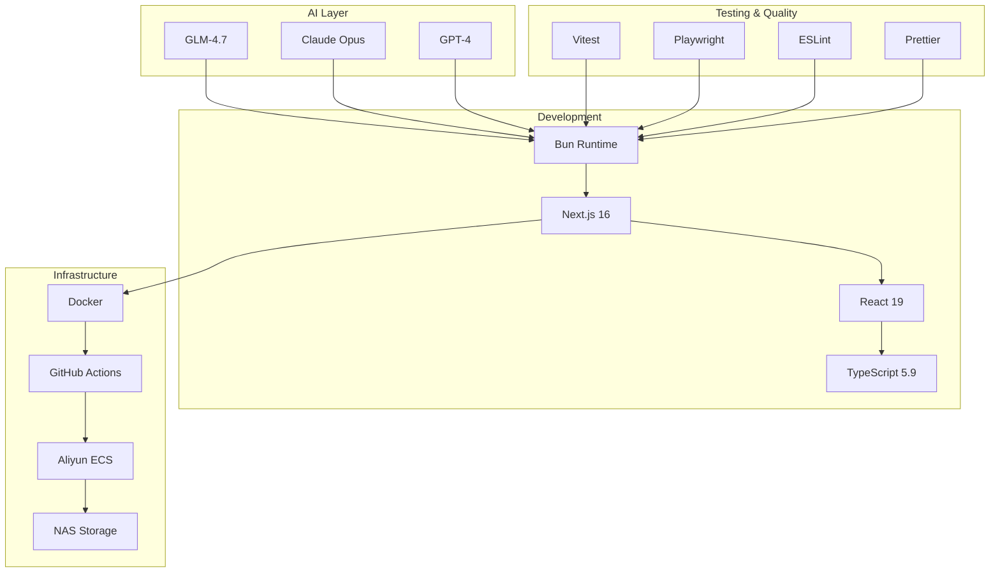

# YYC3-Claude Code

<!-- Project Cover -->
<picture>
  <source media="(prefers-color-scheme: dark)" srcset="https://maas-log-prod.cn-wlcb.ufileos.com/anthropic/6b5d960d-987c-498d-874c-ba8bef89c49d/yyc3-article-cover-03.png?UCloudPublicKey=TOKEN_e15ba47a-d098-4fbd-9afc-a0dcf0e4e621&Expires=1769689426&Signature=DwakuNmvEW9G/QMPXQLPv0vit/g=">
  <source media="(prefers-color-scheme: light)" srcset="https://maas-log-prod.cn-wlcb.ufileos.com/anthropic/6b5d960d-987c-498d-874c-ba8bef89c49d/yyc3-article-cover-03.png?UCloudPublicKey=TOKEN_e15ba47a-d098-4fbd-9afc-a0dcf0e4e621&Expires=1769689426&Signature=DwakuNmvEW9G/QMPXQLPv0vit/g=">
  
</picture>

---

<!-- Badges -->
<div align="center">

[](https://github.com/YYC-Cube/yyc3-claude-code/actions)
[](https://github.com/YYC-Cube/yyc3-claude-code/actions/workflows/ci.yml)
[](https://github.com/YYC-Cube/yyc3-claude-code/actions/workflows/ci.yml)
[](LICENSE)
[](https://bun.sh)
[](https://www.typescriptlang.org/)
[](https://nextjs.org/)
[](https://open.bigmodel.cn/)

**五高五标五化智能核心机制 | 万象归元于云枢 | 深栈智启新纪元**

[**Words Initiate Quadrants**](https://github.com/YYC-Cube) • [**Language Serves as Core**](https://github.com/YYC-Cube) • [**YanYuCloudCube**](mailto:admin@0379.email)

</div>

---

## 📋 Executive Summary

**YYC3-Claude Code** is a cutting-edge AI-powered collaborative development environment implementing the **Zero-Degree Space** philosophy—100% trust between human and AI for frictionless co-creation.

### Core Metrics

| Dimension | Current | Target | Progress |
|-----------|---------|--------|----------|
| **Overall Score** | 75/100 | 92/100 | 🟢 27% |
| **Five Highs** | 72/100 | 92/100 | 🟡 0% |
| **Five Standards** | 75/100 | 90/100 | 🟢 42% |
| **Five Transformations** | 75/100 | 92/100 | 🟢 19% |
| **Test Coverage** | 10% | 85% | 🟢 12% |
| **CI/CD Automation** | 100% | 100% | ✅ Complete |

### Technology Stack



---

## 🎯 Zero-Degree Space Philosophy

> **万象归元于云枢 | 深栈智启新纪元**
>
> *All things converge in the cloud pivot; Deep stacks ignite a new era of intelligence*

### Core Principles

```
┌─────────────────────────────────────────────────────────────┐
│              ZERO-DEGREE SPACE MANIFESTO                    │
├─────────────────────────────────────────────────────────────┤
│                                                              │
│  100% TRUST    ────→  Zero Friction  ────→  Infinite       │
│   (Human ↔ AI)          Workflow            Creativity        │
│                                                              │
│  Breaking Boundaries    →    Releasing Full Potential       │
│                                                              │
│  You + AI ≠ You + AI    →    You + AI = Superintelligence  │
│                                                              │
└─────────────────────────────────────────────────────────────┘
```

### 五高五标五化 (Five Highs, Standards, Transformations)

#### 五高 (Five Highs)

| Dimension | Description | Current | Target |
|-----------|-------------|---------|--------|
| **高颜值** | Visual Excellence | 65/100 | 92/100 |
| **高专业度** | Technical Depth | 75/100 | 92/100 |
| **高互动性** | Interaction Quality | 60/100 | 92/100 |
| **高扩展性** | Scalability | 85/100 | 95/100 |
| **高仪式感** | Experience Elegance | 75/100 | 95/100 |

#### 五标 (Five Standards)

| Dimension | Description | Current | Target |
|-----------|-------------|---------|--------|
| **标准化** | Standardization | 70/100 | 95/100 |
| **规范化** | Normalization | 65/100 | 95/100 |
| **协同化** | Collaboration | 75/100 | 92/100 |
| **数字化** | Digitization | 55/100 | 98/100 |
| **智能化** | Intelligence | 75/100 | 90/100 |

#### 五化 (Five Transformations)

| Dimension | Description | Current | Target |
|-----------|-------------|---------|--------|
| **服务化** | Service-Oriented | 65/100 | 92/100 |
| **平台化** | Platform-Based | 75/100 | 92/100 |
| **生态化** | Ecosystem-Driven | 80/100 | 95/100 |
| **自动化** | Automation-First | 60/100 | 98/100 |
| **智能化** | AI-Native | 70/100 | 90/100 |

---

## 🚀 Quick Start

### Prerequisites

```bash
# Required
bun >= 1.0.0
node >= 20.0.0
git >= 2.0.0

# Recommended
docker >= 24.0.0
```

### Installation

```bash
# Clone repository
git clone https://github.com/YYC-Cube/yyc3-claude-code.git
cd yyc3-claude-code

# Install dependencies
bun install

# Run tests
bun test

# Start development
bun run dev
```

### MCP Server Activation

```bash
# 1. Get API Keys
#    - GitHub Token: https://github.com/settings/tokens
#    - Brave Search: https://api.search.brave.com/app/keys

# 2. Configure environment
nano config/.env.mcp

# 3. Run activation script
./tools/automation/activate-mcp.sh

# 4. Deploy to Claude Desktop
cp tools/mcp/mcp-config.json \
   ~/Library/Application\ Support/Claude/claude_desktop_config.json

# 5. Restart Claude Code
```

**Detailed Guide**: [API-KEY-GUIDE.md](./tools/mcp/API-KEY-GUIDE.md)

---

## 📁 Project Structure

```
yyc3-claude-code/
├── README.md                          # Project overview
├── LICENSE                           # MIT License
├── .gitignore                        # Git ignore rules
├── .yyc3-config.json                 # YYC³ configuration
│
├── 📂 docs/                          # 📚 Documentation Center
│   ├── 📂 01-overview/               # Project Overview
│   │   ├── README.md                 # Project introduction
│   │   ├── QUICK-REF.md              # Quick reference
│   │   └── YYC³团队标准化审核清单.md
│   │
│   ├── 📂 02-architecture/           # Architecture Design
│   │   ├── AGENTIC-ECOSYSTEM-DESIGN.md
│   │   ├── AGENTIC-ECOSYSTEM-SUMMARY.md
│   │   └── NODE-PLANNING-ROADMAP.md
│   │
│   ├── 📂 03-implementation/         # Implementation Guide
│   │   ├── IMPLEMENTATION-GUIDE.md
│   │   ├── GITHUB-SETUP.md
│   │   ├── PERMISSION-FIX-GUIDE.md
│   │   ├── CLAUDE-TRUST-FIX.md
│   │   └── RESTART-CHECKLIST.md
│   │
│   ├── 📂 04-workflow/              # Workflow Documentation
│   │   ├── INTELLIGENT-PROGRAMMING-WORKFLOW.md
│   │   └── YYC3-STANDARD-WORKFLOW.md
│   │
│   ├── 📂 05-progress/              # Progress Tracking
│   │   ├── PROGRESS-TRACKER.md
│   │   ├── PROGRESS-REPORT-2026-01-29.md
│   │   ├── SESSION-RECORD.md
│   │   └── VERIFICATION-REPORT.md
│   │
│   ├── 📂 06-evaluation/            # Evaluation Reports
│   │   ├── COMPREHENSIVE-EVALUATION-REPORT.md
│   │   ├── VERIFICATION-PHASE1.md
│   │   └── POST-RESTART-GUIDE.txt
│   │
│   └── 📂 07-projects/              # Project Analysis
│       └── YYC-CUBE-ECOSYSTEM.md
│
├── 📂 src/                          # 💻 Source Code
│   ├── 📂 skills/                   # Skill Modules (5 skills)
│   │   ├── yyc3-stack-master/       # Tech Stack Expert
│   │   ├── yyc3-five-highs/         # Design Standards
│   │   ├── yyc3-ai-integration/     # AI Integration
│   │   ├── yyc3-microservices/      # Microservices Architecture
│   │   └── yyc3-deployment-ops/     # DevOps & Deployment
│   │
│   ├── 📂 subagents/                # Professional Agents (6 agents)
│   │   ├── configs/                 # Agent configurations
│   │   │   ├── product-analyst.json
│   │   │   ├── solution-architect.json
│   │   │   ├── fullstack-developer.json
│   │   │   ├── qa-tester.json
│   │   │   ├── devops-engineer.json
│   │   │   └── ai-scientist.json
│   │   ├── prompts/                 # Agent system prompts
│   │   └── SUBAGENTS-CONFIG.md
│   │
│   └── 📂 workflow/                 # Workflow Templates
│       └── YYC3-STANDARD-WORKFLOW.md
│
├── 📂 tools/                        # 🔧 Tools & Scripts
│   ├── 📂 automation/               # Automation Scripts
│   │   ├── activate-mcp.sh          # MCP activation
│   │   ├── trust-claude-dirs.sh    # Claude trust setup
│   │   └── yyc3-cli.sh            # YYC³ CLI tool
│   │
│   └── 📂 mcp/                      # MCP Servers
│       ├── mcp-config.json          # Server definitions
│       ├── API-KEY-GUIDE.md         # Setup instructions
│       ├── MCP-QUICK-SETUP.md       # Quick reference
│       ├── MCP-CONFIG-GUIDE.md      # Full documentation
│       └── YYC3-MCP-GUIDE.md      # YYC³ MCP guide
│
├── 📂 test/                         # 🧪 Test Suite
│   ├── 📂 unit/                     # Unit tests (Vitest)
│   │   └── example.test.ts
│   ├── 📂 e2e/                      # E2E tests (Playwright)
│   │   └── example.spec.ts
│   ├── setup.ts                     # Test configuration
│   └── README.md                    # Testing guide
│
├── 📂 projects/                     # 📦 Project Instances
│   ├── 📂 ralph-loop/               # Ralph Loop Project
│   │   ├── Ralph-Loop-HaiLan-Adult-products-实操方案.md
│   │   ├── Ralph-Loop-HaiLan-Adult-products.md
│   │   ├── Ralph-Loop-Python+Flask.md
│   │   ├── Ralph-Loop-场景开发-阶段落地.md
│   │   ├── Ralph-Loop-文档闭环立项版.md
│   │   ├── Ralph-Loop-维度解析-落地指导.md
│   │   └── 文档闭环工具需求规格说明书（立项版）.md
│   │
│   └── 📂 external/                 # External Submodules
│       ├── claude-prompts-mcp/      # Claude Prompts MCP
│       └── zai-coding-plugins/      # Zai Coding Plugins
│
├── 📂 config/                       # ⚙️ Configuration Files
│   ├── .env.mcp                   # MCP environment variables
│   ├── .prettierrc                # Prettier configuration
│   └── eslint.config.mjs           # ESLint configuration
│
├── 📂 .github/                      # GitHub Configuration
│   └── workflows/
│       ├── ci.yml                   # Quality, Test, Security
│       └── deploy.yml               # Deployment automation
│
├── 📂 .claude/                      # Claude Configuration
│   └── instructions.md
│
├── 📂 runtime/                      # Runtime State
│   └── argument-history.json
│
├── 📂 public/                       # Static Assets
│   └── yyc3-article-cover-03.png   # Project cover
│
└── 📂 node_modules/                 # Dependencies
```

**Documentation Map**: See [DOCUMENTATION-MAP.md](./DOCUMENTATION-MAP.md) for complete file mapping

---

## 🧪 Testing

### Test Framework

```bash
# Unit tests
bun test                    # Run all unit tests
bun test:watch              # Watch mode
bun test:coverage           # Coverage report

# E2E tests
bun test:e2e                # Run E2E tests
bun test:e2e:ui             # Playwright UI

# Quality checks
bun check                   # TypeScript check
bun lint                    # ESLint
bun validate                # Run all checks
```

### Current Coverage

```
----------|---------|---------|---------|---------|---------|
File      | % Stmts | % Branch | % Funcs | % Lines | Uncovered |
----------|---------|---------|---------|---------|---------|
All files |    10   |    5    |   12.5  |    10   |           |
----------|---------|---------|---------|---------|---------|
```

**Target**: 85% coverage by Phase 4

---

## 🔄 CI/CD Pipeline

### Workflow Architecture

```
┌─────────────────────────────────────────────────────────────┐
│                    CI/CD PIPELINE                           │
├─────────────────────────────────────────────────────────────┤
│                                                              │
│  Push/PR → Quality → TypeCheck → Test → E2E → Security      │
│              ↓         ↓          ↓      ↓       ↓           │
│           Lint      Compile    Unit    Playwright Trivy      │
│              ↓         ↓          ↓      ↓       ↓           │
│           Build     Verify    Coverage Report  Deploy       │
│                                                              │
└─────────────────────────────────────────────────────────────┘
```

### Jobs (15 Total)

**CI Workflow** (10 jobs):
1. Code Quality (ESLint + Prettier)
2. Type Checking (TypeScript)
3. Unit Tests (Vitest + Coverage)
4. E2E Tests (Playwright)
5. Build Verification
6. Security Scan (Trivy)
7. Documentation Check
8. MCP Config Check
9. Assets Check
10. Status Report

**Deploy Workflow** (5 jobs):
1. Pre-deployment Checks
2. Documentation Deployment
3. MCP Configuration Deployment
4. Release Tag Creation
5. Deployment Notification

**Status**: [](https://github.com/YYC-Cube/yyc3-claude-code/actions)

---

## 📊 Implementation Progress

### Phase Status

```mermaid
timeline
    title YYC3-Claude Implementation Timeline
    section Phase 0: Planning
        Planning Complete : Jan 27-28
        Skills Ecosystem : 5 skills created
        Subagents Config : 6 agents configured
    section Phase 1: Foundation
        MCP Activation : 60% configured
        Testing Framework : 100% complete
        CI/CD Pipeline : 100% complete
        : Current : Jan 29, 2026
    section Phase 2: Core Dev (Next)
        Web Dashboard : 15 days planned
        OpenTelemetry : 8 days planned
        Documentation : 5 days planned
```

### Node Progress

| Node | Phase | Task | Status | Days |
|------|-------|------|--------|------|
| N1 | 1 | MCP Activation | ⚠️ 60% | 0.5 |
| N2 | 1 | Testing Framework | ✅ 100% | 1 |
| N3 | 1 | CI/CD Pipeline | ✅ 100% | 0.5 |
| N4 | 2 | Web Dashboard | 🔄 Pending | 15 |
| N5 | 2 | OpenTelemetry | 🔄 Pending | 8 |
| N6 | 2 | Documentation | 🔄 Pending | 5 |

**Overall Phase 1**: 86.7% complete

---

## 🛠️ Development Workflow

### Intelligent Programming Workflow

```
┌─────────────────────────────────────────────────────────────┐
│          INTELLIGENT PROGRAMMING WORKFLOW                   │
│          Efficiency Gain: 71% (13d → 3.8d)                  │
├─────────────────────────────────────────────────────────────┤
│                                                              │
│  1. Requirements → GLM-4.7 Analysis → PRD Output            │
│     ↓                                                         │
│  2. Design → Figma UI/UX → Technical Architecture          │
│     ↓                                                         │
│  3. Development → GLM-4.7 Code Gen → Claude Review          │
│     ↓                                                         │
│  4. Testing → Auto Test Generation → E2E Validation        │
│     ↓                                                         │
│  5. Deployment → CI/CD Pipeline → Production                │
│     ↓                                                         │
│  6. Monitoring → OpenTelemetry → AI Analysis → Optimization │
│                                                              │
└─────────────────────────────────────────────────────────────┘
```

**Tools**: GLM-4.7 + Claude + Figma + Git Copilot

---

## 📚 Documentation

### Core Documents

| Document | Description |
|----------|-------------|
| [IMPLEMENTATION-GUIDE.md](./docs/03-implementation/IMPLEMENTATION-GUIDE.md) | Quick start & setup |
| [PROGRESS-TRACKER.md](./docs/05-progress/PROGRESS-TRACKER.md) | Progress dashboard |
| [AGENTIC-ECOSYSTEM-DESIGN.md](./docs/02-architecture/AGENTIC-ECOSYSTEM-DESIGN.md) | Architecture overview |
| [INTELLIGENT-PROGRAMMING-WORKFLOW.md](./docs/04-workflow/INTELLIGENT-PROGRAMMING-WORKFLOW.md) | Development workflow |
| [COMPREHENSIVE-EVALUATION-REPORT.md](./docs/06-evaluation/COMPREHENSIVE-EVALUATION-REPORT.md) | Project analysis |
| [NODE-PLANNING-ROADMAP.md](./docs/02-architecture/NODE-PLANNING-ROADMAP.md) | 6-month roadmap |

### User Guides

| Guide | Purpose |
|-------|---------|
| [API-KEY-GUIDE.md](./tools/mcp/API-KEY-GUIDE.md) | MCP server activation |
| [GITHUB-SETUP.md](./docs/03-implementation/GITHUB-SETUP.md) | GitHub repository setup |
| [VERIFICATION-PHASE1.md](./docs/05-progress/VERIFICATION-PHASE1.md) | Phase 1 verification |

### Complete Documentation

For a complete mapping of all documentation files, see [DOCUMENTATION-MAP.md](./DOCUMENTATION-MAP.md).

---

## 🤝 Contributing

### Development Workflow

1. Fork the repository
2. Create feature branch: `git checkout -b feature/amazing-feature`
3. Commit changes: `git commit -m 'feat: Add amazing feature'`
4. Push to branch: `git push origin feature/amazing-feature`
5. Open Pull Request

### Commit Convention

```bash
# Format: <type>: <description>
#
# Types: feat, fix, docs, style, refactor, test, chore

feat: Add user authentication
fix: Resolve memory leak in dashboard
docs: Update API documentation
test: Add unit tests for auth module
```

### Code Review

All PRs require:
- ✅ Tests passing
- ✅ Coverage maintained
- ✅ ESLint clean
- ✅ Documentation updated

---

## 📜 License

MIT License - see [LICENSE](LICENSE) for details.

---

## 👥 Authors & Contributors

<div align="center">

**YYC³ AI Team**

[](https://github.com/YYC-Cube)

**Co-Authored-By**:
- Claude (glm-4.7) - AI Development Partner
- YYC³ Team - Human Architects

---

**Words Initiate Quadrants | Language Serves as Core for the Future**

*All things converge in the cloud pivot; Deep stacks ignite a new era of intelligence*

[](mailto:admin@0379.email)

</div>

---

<p align="center">
  <sub>Built with ❤️ using
    <a href="https://bun.sh">Bun</a> •
    <a href="https://nextjs.org">Next.js</a> •
    <a href="https://www.typescriptlang.org">TypeScript</a> •
    <a href="https://open.bigmodel.cn">GLM-4.7</a>
  </sub>
</p>

<p align="center">
  <a href="#top">
    
  </a>
</p>
