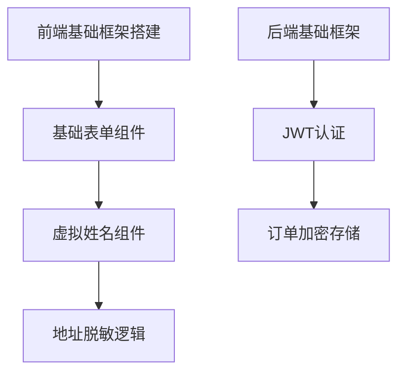

# HaiLan Adult Products 项目 Ralph Loop 可落地实操方案

基于 Ralph Loop 的5阶段闭环逻辑，为「HaiLan Adult Products 情趣健康生活管理平台」制定适配其核心特性（隐私保护、多端适配、合规性、YYC³标准）的可落地执行方案，且匹配你指定的 AI 工具链（Cursor+通义千问、Claude 3.5+CodeLlama 等）。以下方案完全贴合项目实际结构、技术栈和合规要求，从「需求精准化→任务拆解→闭环执行→验收→沉淀」全链路给出**一步一操作**的落地指南，所有步骤可直接复刻。

## 核心适配前提

本项目的**高合规性、强隐私保护、多端适配**是核心差异点，因此 Ralph Loop 执行的核心原则为：

1. 隐私/合规相关模块（如订单加密、内容过滤、数据脱敏）**必须用人机协作版闭环**，禁止全挂机；
2. 基础功能模块（如商品列表、基础UI）可用「挂机版闭环」；
3. 所有验收环节需增加「合规性验证」（内容过滤、隐私加密）和「多端适配验证」（小程序/H5）；
4. 全程遵循 YYC³ 「五高五标五化」标准，文档化/流程化贯穿全阶段。

## 阶段1：需求精确定义阶段——聚焦「隐私+合规+多端」的精准化

### 核心目标

将项目概述中的「模糊需求」（如“隐私保护机制”）转化为**AI可执行、可量化、合规无歧义**的需求文档，重点明确隐私/合规/多端的验收标准。

### 操作步骤（可直接复制执行）

#### 步骤1：提取核心需求要素（按模块拆分）

| 模块         | 功能目标                          | 非功能目标（量化）| 约束条件                                  |
|--------------|-----------------------------------|-------------------------------------------|-------------------------------------------|
| 前端（Uni-app） | 商品浏览/购物车/匿名下单/多端适配 | 1. 小程序/H5加载≤300ms；2. 匿名下单流程无敏感字段暴露；3. 适配iOS/Android小程序 | Vue3+TS、Uni-app、Bootstrap 5、PWA 架构 |
| 后端（NestJS） | 用户认证/订单加密/内容过滤/数据脱敏 | 1. JWT过期时间2h；2. 订单信息AES加密存储；3. 违规内容过滤准确率≥99%；4. 接口响应≤200ms | Node.js≥18、MongoDB、Prisma、bcryptjs |
| 后台管理     | 商品管理/订单管理/数据脱敏显示    | 1. 敏感信息（手机号）脱敏为138****1234；2. 数据统计报表生成≤5s | Bootstrap 5、jQuery、数据脱敏规则        |
| AI客服/推荐  | 合规对话/隐私推荐                | 1. 过滤100%违规话术（如涉黄/违法）；2. 推荐无敏感关键词；3. 回复延迟≤1s | Gemini 1.5 Pro、LangChain、违规词库      |

#### 步骤2：转化为精准需求表述（规避模糊词）

以「匿名下单功能」为例，精准表述模板（可套用）：
> 开发Uni-app前端匿名下单功能，需满足：
>
> 1. 功能：用户下单时可填写虚拟姓名（默认“先生/女士”），收货地址隐藏详细门牌号（仅显示到小区/街道）；
> 2. 非功能：订单提交后，前端本地存储的收货信息10分钟后自动清除，小程序/H5端均生效；
> 3. 合规：订单表单无“情趣产品”等敏感关键词，所有输入框无自动填充敏感信息；
> 4. 技术约束：基于Vue3+TS开发，符合Uni-app多端适配规范，代码遵循YYC³ camelCase命名规则。

#### 步骤3：AI辅助校验需求完整性（指定工具：Claude 3.5）

向 Claude 3.5 发送以下指令，补全隐私/合规遗漏点：
> 指令模板：
> 请作为资深隐私合规开发工程师，校验以下需求的完整性：
>
> 1. 检查隐私保护（订单加密、数据脱敏、匿名下单）的边界场景（如虚拟姓名为空、敏感地址输入）；
> 2. 检查情趣产品相关的合规风险（内容过滤、关键词屏蔽）；
> 3. 检查Uni-app多端适配的遗漏场景（如小程序分享、H5支付兼容）；
> 4. 补充遗漏的验收标准和技术约束，输出完整精准需求文档。
> 需求内容：[粘贴步骤2的精准需求]

#### 步骤4：人工评审（核心：合规+隐私）

组织团队评审以下核心点，形成终版需求文档：

- 隐私保护：订单加密算法、数据脱敏规则是否符合行业规范；
- 合规性：违规词库是否覆盖情趣产品相关敏感词；
- 多端适配：小程序/H5的兼容性要求是否明确；
- 量化标准：所有非功能目标（如响应时间、过滤准确率）是否可验证。

### 本阶段输出物

- 《HaiLan 项目精准需求文档（终版）》：含前端/后端/管理端/AI模块的功能+量化验收标准+约束；
- 违规词库清单（AI客服/内容过滤用）；
- 隐私加密规则文档（AES加密参数、数据脱敏规则）。

## 阶段2：任务分层拆解阶段——按「模块+风险等级」拆解最小任务

### 核心目标

按「项目层→模块层→最小任务层」拆解，标注每个任务的「风险等级」（高/中/低）和「AI工具匹配」，隐私/合规相关为高风险，必须人机协作。

### 操作步骤（贴合项目结构）

#### 步骤1：拆分大模块（按项目结构+风险等级）

| 模块ID | 模块名称                | 风险等级 | AI工具匹配                | 闭环模式       |
|--------|-------------------------|----------|---------------------------|----------------|
| M01    | 前端Uni-app基础框架     | 低       | Cursor + 通义千问         | 挂机版         |
| M02    | 前端商品/购物车功能     | 中       | Cursor + 通义千问         | 人机协作版     |
| M03    | 前端匿名下单/隐私保护   | 高       | Cursor + 通义千问         | 人机协作版     |
| M04    | 后端NestJS基础框架      | 低       | Claude 3.5 + CodeLlama    | 挂机版         |
| M05    | 后端用户认证/订单加密   | 高       | Claude 3.5 + CodeLlama    | 人机协作版     |
| M06    | 后端内容过滤/数据脱敏   | 高       | Claude 3.5 + CodeLlama    | 人机协作版     |
| M07    | 后台管理基础UI          | 低       | Cursor + 即时设计AI       | 挂机版         |
| M08    | 后台管理数据脱敏显示    | 高       | Cursor + 即时设计AI       | 人机协作版     |
| M09    | AI客服/推荐逻辑         | 高       | Gemini 1.5 Pro + LangChain | 人机协作版     |

#### 步骤2：拆解最小任务（示例：高风险模块M03「前端匿名下单」）

| 任务ID   | 任务内容                                  | 验收标准（非黑即白）| 依赖任务       | 执行工具          |
|----------|-------------------------------------------|-------------------------------------------|----------------|-------------------|
| M03-001  | 开发虚拟姓名输入组件                      | 1. 组件默认显示“先生”；2. 支持自定义输入；3. 小程序/H5显示一致 | M01-005（基础表单组件） | Cursor+通义千问   |
| M03-002  | 开发收货地址脱敏逻辑                      | 1. 输入详细门牌号自动隐藏；2. 仅显示到小区/街道；3. 本地存储无完整地址 | M03-001         | Cursor+通义千问   |
| M03-003  | 开发订单表单敏感词过滤                    | 1. 输入“情趣”“成人”等词自动替换为“健康产品”；2. 无敏感词提交到后端 | M03-002         | Cursor+通义千问   |
| M03-004  | 开发本地收货信息自动清除逻辑              | 1. 下单完成后10分钟自动清除；2. 清除前有提示；3. 小程序/H5均生效 | M03-003         | Cursor+通义千问   |

#### 步骤3：AI校验拆解合理性（指定工具：Claude 3.5）

发送以下指令，优化任务颗粒度和依赖关系：
> 指令模板：
> 请校验以下任务拆解的合理性：
>
> 1. 检查每个任务是否为AI 5-15分钟可完成；
> 2. 检查高风险任务（隐私/合规）的验收标准是否覆盖隐私保护；
> 3. 检查依赖关系是否正确（如先开发基础组件，再开发脱敏逻辑）；
> 4. 优化不合理的任务，输出最终任务清单。
> 任务清单：[粘贴所有模块的最小任务]

### 本阶段输出物

- 《HaiLan 项目标准化任务清单》：含所有任务的ID/内容/验收标准/依赖/工具/闭环模式；
- 任务依赖关系图（用Mermaid绘制，示例如下）：



## 阶段3：分阶段闭环执行阶段——按「风险等级+工具」匹配执行模式

### 核心准备：环境隔离（必做！）

1. **代码隔离**：创建项目专属分支 `ralph-hailan`，所有AI执行的代码均提交至此分支；
2. **依赖配置**：生成各模块的依赖文件（前端`package.json`、后端`prisma/schema.prisma`），明确版本：

   ```bash
   # 前端Uni-app依赖示例
   npm install vue@3.3.4 typescript@5.1.6 uniapp-ui@1.0.0
   # 后端NestJS依赖示例
   npm install @nestjs/core@10.2.7 @nestjs/jwt@10.1.1 bcryptjs@2.4.3
   ```

3. **隐私配置隔离**：加密密钥、违规词库等敏感配置单独存储在`.env.private`，AI仅获取脱敏后的配置示例。

### 分模式执行操作（核心落地步骤）

#### 模式1：挂机版闭环（低风险模块，如M01前端基础框架）

##### 操作流程（以Cursor为例）

1. 打开Cursor，创建新的Uni-app项目文件，发送以下循环指令：
   > 指令模板：
   > 请全自动执行以下任务，无需询问，仅在环境错误时告知：
   > 1. 执行顺序：按M01-001→M01-002→M01-003执行；
   > 2. 单任务流程：编写代码→按验收标准自测→测试通过保存代码→抓取下一个任务；失败则重修；
   > 3. 代码要求：符合Vue3+TS、Uni-app规范，遵循YYC³ camelCase命名；
   > 4. 输出：每完成一个任务，输出文件路径+代码内容。
   > 任务清单：
   > M01-001：搭建Uni-app基础目录结构（pages/css/js/assets）；
   > M01-002：配置PWA架构（manifest.json、service-worker.js）；
   > M01-003：集成Bootstrap 5样式，实现基础页面布局。
2. 后台监控：仅在Cursor提示「环境错误」（如依赖缺失）时手动介入，安装对应依赖；
3. 保存代码：将Cursor生成的代码提交到`ralph-hailan`分支，标注任务ID。

#### 模式2：人机协作版闭环（高风险模块，如M05后端订单加密）

##### 操作流程（以Claude 3.5+CodeLlama为例）

1. 按「2个任务为一批」拆分执行批次，第一批执行：
   - M05-001：开发JWT认证接口（验收标准：返回token，过期时间2h）；
   - M05-002：开发订单信息AES加密函数（验收标准：加密后数据库无明文，解密可还原）；
2. 向Claude 3.5发送指令，执行第一批任务：
   > 指令模板：
   > 请执行以下2个任务，完成后输出完整代码，我会审核后再继续：
   > 1. 任务M05-001：基于NestJS+Prisma开发JWT认证接口，参数：用户名/密码，返回token，exp=2h；
   > 2. 任务M05-002：开发AES加密函数，加密订单的收货姓名/地址，密钥从.env读取；
   > 3. 代码要求：符合YYC³规范，包含单元测试，注释说明加密逻辑。
3. AI完成后，**人工审核核心点**：
   - JWT密钥是否安全（非硬编码）；
   - AES加密算法是否符合隐私规范（密钥长度≥128位）；
   - 代码是否包含异常处理（如加密失败、token过期）；
4. 审核通过→提交代码，执行下一批任务（M05-003：订单加密存储；M05-004：解密查询接口）；
5. 审核不通过→将问题拆解为小修复任务（如「修复JWT硬编码密钥问题」），让AI重修后再次审核。

### 本阶段输出物

- `ralph-hailan`分支下的可运行代码（前端/后端/管理端/AI模块）；
- 任务运行日志：含每个任务的执行结果/失败原因/修复方案；
- 单元测试用例（AI生成+人工优化）。

## 阶段4：人机协同验收阶段——重点验证「隐私+合规+多端」

### 核心目标

AI做基础测试，人类聚焦「隐私合规、多端适配、边缘场景」，确保项目符合需求和行业规范。

### 操作步骤

#### 步骤1：AI全量自验（指定工具：Claude 3.5+Gemini 1.5）

向AI发送自验指令，覆盖所有模块：
> 指令模板：
> 请基于精准需求文档，完成以下自验：
>
> 1. 前端：测试商品浏览/匿名下单/多端适配（小程序/H5），验证敏感词过滤；
> 2. 后端：测试JWT认证/订单加密/数据脱敏，验证接口响应时间；
> 3. AI客服：测试10条违规话术（如“成人用品”“情趣玩具”），验证过滤效果；
> 4. 输出自验报告：通过项/未通过项/问题描述。

#### 步骤2：分层人工验收（核心：隐私+合规+多端）

| 验收层级       | 验收内容                                  | 验收工具/方法                          | 边缘场景测试                          |
|----------------|-------------------------------------------|---------------------------------------|---------------------------------------|
| 模块验收       | 前端：匿名下单流程、敏感词过滤            | 小程序开发者工具、H5浏览器、抓包工具  | 1. 虚拟姓名为空；2. 输入极端敏感词；3. 小程序分享下单页面 |
|                | 后端：订单加密、数据脱敏                  | Postman、MongoDB客户端、单元测试       | 1. 加密订单查询失败；2. 脱敏后数据还原异常；3. 高并发下单 |
|                | AI客服：违规话术过滤                      | 手动输入违规词、LangChain测试脚本      | 1. 谐音违规词（如“情趣”）；2. 组合违规词 |
| 整体联调       | 前端→后端→AI客服全流程                    | 端到端测试（下单→支付→客服咨询）| 1. 匿名下单后客服无法获取真实信息；2. 多端同步订单数据 |
| 多端适配       | 小程序（iOS/Android）、H5、PWA            | 真机测试、浏览器兼容性工具            | 1. 小程序低版本适配；2. H5支付页面样式错乱 |
| 隐私合规       | 数据加密、脱敏、匿名化                    | 数据库查询、日志审计、隐私合规检查工具 | 1. 后台管理是否能看到明文手机号；2. 订单日志是否包含敏感信息 |

#### 步骤3：问题闭环处理

- 轻微问题（如H5样式错位）：拆解为小任务，让AI修复后重新验收；
- 核心问题（如订单加密失效）：回到阶段3，重新执行对应模块的人机协作闭环；
- 合规问题（如AI客服未过滤违规词）：更新违规词库，让AI重新训练对话逻辑。

### 本阶段输出物

- 《HaiLan 项目验收报告》：含自验/人工验收结果、问题修复记录；
- 多端适配测试报告（小程序/H5/PWA）；
- 隐私合规审计报告。

## 阶段5：知识沉淀复用阶段——聚焦「隐私+合规+多端」的复用价值

### 核心目标

沉淀项目中可复用的「隐私合规模板、多端适配经验、AI工具指令」，为后续迭代或同类项目提效。

### 操作步骤

#### 步骤1：整理场景化日志

按「模块+场景」分类归档日志，重点：

- 隐私合规场景：订单加密代码模板、数据脱敏规则、违规词库；
- 多端适配场景：Uni-app小程序/H5兼容问题及解决方案；
- AI工具场景：Cursor/Claude/Gemini的最优指令模板。

#### 步骤2：提炼标准化模板（可直接复用）

| 模板类型                | 模板内容                                  | 存储位置                  |
|-------------------------|-------------------------------------------|---------------------------|
| 需求文档模板            | 隐私合规类项目的精准需求表述模板          | docs/templates/需求模板.md |
| 任务拆解模板            | 高风险隐私模块的任务拆解模板              | docs/templates/任务模板.md |
| 代码模板                | AES加密函数、数据脱敏函数、敏感词过滤函数 | packages/utils/模板代码/  |
| AI指令模板              | Cursor/Claude/Gemini的闭环执行指令        | docs/templates/AI指令.md  |

#### 步骤3：团队复用与迭代

- 将模板共享到团队知识库（语雀/飞书）；
- 后续迭代（如新增“隐私配送查询”功能）直接复用模板，仅修改业务逻辑；
- 每次复用后，更新模板（如新增多端适配的新问题解决方案）。

### 本阶段输出物

- 《HaiLan 项目 Ralph Loop 知识库》：含日志库/模板库/经验库；
- 隐私合规代码模板库（可直接导入项目使用）；
- AI工具最优指令集（适配情趣产品合规开发）。

## 跨阶段大闭环联动（项目迭代示例）

若后续需要新增「隐私配送轨迹查询」功能，联动逻辑：

1. 复用阶段5的「隐私需求模板」，快速生成精准需求；
2. 复用阶段5的「任务拆解模板」，拆分最小任务；
3. 阶段3：匹配Cursor+Claude执行闭环（高风险，人机协作）；
4. 阶段4：验收隐私配送轨迹的匿名化（隐藏配送员信息）；
5. 阶段5：将配送轨迹的隐私逻辑补充到知识库。

## 关键落地注意事项

1. **隐私合规优先**：所有涉及用户数据的代码，人工审核时必须检查是否存在明文存储、硬编码密钥；
2. **多端适配验证**：小程序/H5的测试必须用真机，避免AI模拟测试的偏差；
3. **AI工具分工**：前端多端适配用Cursor+通义千问，后端隐私逻辑用Claude 3.5+CodeLlama，AI客服用Gemini 1.5；
4. **文档化贯穿**：每个阶段的输出物均按YYC³「文档化」要求，存储到docs目录，便于追溯。

## 总结

### 核心要点回顾

1. 本项目的Ralph Loop落地核心是「风险分层」：隐私/合规高风险模块用人机协作，基础模块用挂机版，平衡效率与安全；
2. 验收环节必须增加「隐私合规+多端适配」验证，这是情趣产品项目的核心差异点；
3. 知识沉淀聚焦「隐私合规模板」，这类模板在同类项目中复用价值极高，可大幅降低后续开发成本。

按此方案执行，可实现「AI完成80%基础开发，人类聚焦20%核心隐私/合规把控」，既符合YYC³标准，又能高效完成项目落地。如需针对某个具体模块（如AI客服违规过滤）生成「逐行执行的指令模板」，可告知我。
