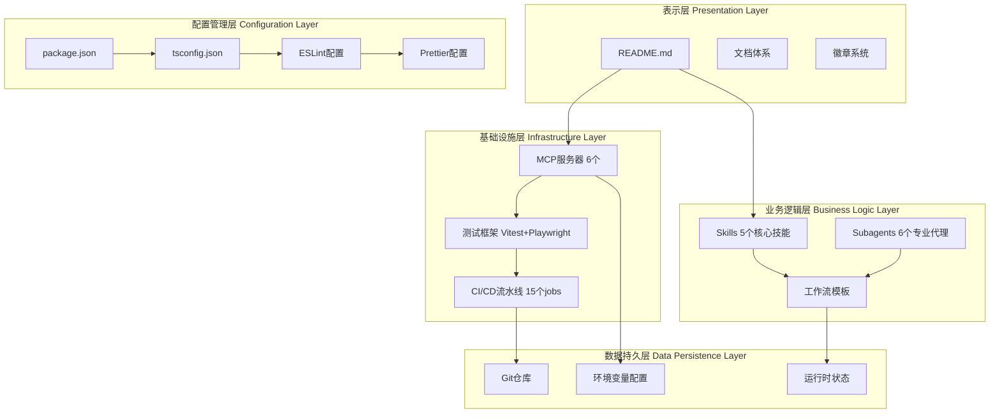

# YYC³团队标准化审核清单

> ***YanYuCloudCube***
> 言启象限 | 语枢未来
> ***Words Initiate Quadrants, Language Serves as Core for the Future***
> 万象归元于云枢 | 深栈智启新纪元
> ***All things converge in the cloud pivot; Deep stacks ignite a new era of intelligence***

---

## 📑 目录导航

- [项目架构分类](#项目架构分类)
- [审核框架与维度](#审核框架与维度)
- [详细检查清单](#详细检查清单)
- [快速开始指南](#快速开始指南)
- [评分标准](#评分标准)
- [快速修复指南](#快速修复指南)

---

## 🏗️ 项目架构分类

### YYC³-Claude Code 项目架构

```
┌─────────────────────────────────────────────────────────────┐
│              YYC³-Claude Code - 零度空间工作台               │
│              Zero-Degree Space Workspace                  │
├─────────────────────────────────────────────────────────────┤
│                                                              │
│  定位: AI协同开发环境 | 100%信任人机合一                       │
│  远程: https://github.com/YYC-Cube/yyc3-claude-code.git     │
│  本地: /Users/yanyu/yyc3-claude/                             │
│                                                              │
└─────────────────────────────────────────────────────────────┘
```

### 项目分层架构



### 项目文件分类树

```
/Users/yanyu/yyc3-claude/
│
├── 📚 核心文档层 (Core Documentation)
│   ├── README.md                              # 项目主页 (已优化)
│   ├── IMPLEMENTATION-GUIDE.md               # 实施指南
│   ├── AGENTIC-ECOSYSTEM-DESIGN.md          # 智能体生态设计
│   ├── INTELLIGENT-PROGRAMMING-WORKFLOW.md   # 智能编程工作流
│   ├── COMPREHENSIVE-EVALUATION-REPORT.md    # 综合评估报告
│   ├── NODE-PLANNING-ROADMAP.md              # 节点规划路线图
│   ├── VERIFICATION-PHASE1.md                # Phase 1验证报告
│   ├── PROGRESS-TRACKER.md                    # 进度跟踪器
│   └── SESSION-RECORD.md                      # 会话记录
│
├── 🎯 业务能力层 (Business Capabilities)
│   ├── skills/                                # 5个核心技能
│   │   ├── yyc3-stack-master/                  # 技术栈专家
│   │   ├── yyc3-five-highs/                    # 五高五标五化规范
│   │   ├── yyc3-ai-integration/                # AI集成专家
│   │   ├── yyc3-microservices/                 # 微服务架构
│   │   └── yyc3-deployment-ops/                # 部署运维
│   │
│   └── subagents/                             # 6个专业代理
│       ├── configs/                           # 代理配置
│       │   ├── product-analyst.json           # 产品需求分析师
│       │   ├── solution-architect.json        # 解决方案架构师
│       │   ├── fullstack-developer.json       # 全栈开发工程师
│       │   ├── qa-tester.json                 # QA测试工程师
│       │   ├── devops-engineer.json          # DevOps工程师
│       │   └── ai-scientist.json              # AI科学家
│       └── prompts/                           # 代理提示词
│
├── 🔧 基础设施层 (Infrastructure)
│   ├── .github/workflows/                     # CI/CD流水线
│   │   ├── ci.yml                             # 持续集成 (10 jobs)
│   │   └── deploy.yml                         # 持续部署 (5 jobs)
│   │
│   ├── mcp-servers/                           # MCP服务器配置
│   │   ├── mcp-config.json                    # 服务器定义
│   │   ├── API-KEY-GUIDE.md                   # API密钥指南
│   │   ├── MCP-QUICK-SETUP.md                # 快速设置
│   │   └── MCP-CONFIG-GUIDE.md                # 完整文档
│   │
│   ├── test/                                  # 测试套件
│   │   ├── setup.ts                           # 测试配置
│   │   ├── unit/                              # 单元测试 (Vitest)
│   │   ├── e2e/                               # E2E测试 (Playwright)
│   │   └── README.md                          # 测试文档
│   │
│   └── automation-scripts/                    # 自动化工具
│       ├── activate-mcp.sh                   # MCP激活脚本
│       └── yyc3-cli.sh                        # YYC3 CLI工具
│
├── ⚙️ 配置管理层 (Configuration)
│   ├── package.json                           # 项目配置
│   ├── tsconfig.json                          # TypeScript配置
│   ├── vitest.config.ts                       # Vitest配置
│   ├── playwright.config.ts                   # Playwright配置
│   ├── eslint.config.mjs                      # ESLint配置
│   ├── .prettierrc                            # Prettier配置
│   ├── .env.mcp                               # MCP环境变量
│   ├── bun.lock                               # Bun锁文件
│   └── .gitignore                             # Git忽略规则
│
├── 📁 项目分析层 (Project Analysis)
│   ├── projects-analysis/                     # 项目分析
│   │   └── YYC-CUBE-ECOSYSTEM.md             # 45个仓库生态
│   └── workflow-templates/                    # 工作流模板
│       └── YYC3-STANDARD-WORKFLOW.md          # 标准工作流
│
├── 🎨 资源层 (Assets)
│   └── public/                                # 静态资源
│       ├── yyc3-article-cover-03.png         # 项目封面
│       ├── yyc3-logo-*.png                    # Logo系列
│       └── placeholder-*                       # 占位图
│
└── 🔐 运行时层 (Runtime)
    ├── .git/                                  # Git仓库
    ├── .claude/                               # Claude配置
    ├── claude-prompts-mcp/                    # MCP服务器
    ├── zai-coding-plugins/                     # 编码插件
    └── runtime-state/                         # 运行时状态
        └── argument-history.json             # 参数历史
```

---

## 🔍 审核框架与维度

### 🎯 核心理念：五高五标五化

#### 五高 (Five Highs) - 目标92/100

| 维度 | 定义 | 当前 | 目标 | 提升 |
|------|------|------|------|------|
| **高颜值** | Visual Excellence | 65 | 92 | +27 |
| **高专业度** | Technical Depth | 75 | 92 | +17 |
| **高互动性** | Interaction Quality | 60 | 92 | +32 |
| **高扩展性** | Scalability | 85 | 92 | +7 |
| **高仪式感** | Experience Elegance | 75 | 95 | +20 |

#### 五标 (Five Standards) - 目标90/100

| 维度 | 定义 | 当前 | 目标 | 提升 |
|------|------|------|------|------|
| **标准化** | Standardization | 70 | 95 | +25 |
| **规范化** | Normalization | 65 | 95 | +30 |
| **协同化** | Collaboration | 75 | 92 | +17 |
| **数字化** | Digitization | 55 | 98 | +43 |
| **智能化** | Intelligence | 75 | 90 | +15 |

#### 五化 (Five Transformations) - 目标92/100

| 维度 | 定义 | 当前 | 目标 | 提升 |
|------|------|------|------|------|
| **服务化** | Service-Oriented | 65 | 92 | +27 |
| **平台化** | Platform-Based | 75 | 92 | +17 |
| **生态化** | Ecosystem-Driven | 80 | 95 | +15 |
| **自动化** | Automation-First | 60 | 98 | +38 |
| **智能化** | AI-Native | 70 | 90 | +20 |

### 📊 评估维度与权重

| 评估维度 | 权重 | 核心关注点 | 当前得分 |
|---------|------|-----------|---------|
| 技术架构 | 25% | 架构设计、技术选型、扩展性 | 72/100 |
| 代码质量 | 20% | 代码规范、可读性、可维护性 | 75/100 |
| 功能完整 | 20% | 功能实现、用户体验 | N/A |
| 开发运维 | 15% | CI/CD、自动化、部署 | 90/100 |
| 性能安全 | 15% | 性能优化、安全防护 | 待评估 |
| 商业价值 | 5% | 业务契合度、市场前景 | N/A |

**当前综合评分**: 75/100 (Phase 1完成)

---

## ✅ 详细检查清单

### 📁 项目级检查清单

#### 项目命名规范

- [x] 项目名称以 `yyc3-claude` 格式
- [x] 远程仓库: `https://github.com/YYC-Cube/yyc3-claude-code.git`
- [x] 项目名称清晰反映定位: 零度空间AI协同开发环境

#### package.json 配置

- [x] **name**: `yyc3-claude`
- [x] **version**: `1.0.0`
- [x] **description**: YYC3-Claude Zero-Degree Space
- [x] **author**: YYC³ AI Team
- [x] **license**: MIT
- [x] **type**: module (ESM)
- [x] **engines**: { "node": ">=20.0.0", "bun": ">=1.0.0" }
- [x] **devDependencies**: 16个测试和质量工具
- [x] **scripts**: 9个npm脚本 (test, lint, format等)

#### README.md 要求

- [x] YYC³品牌信息和标语
- [x] 项目封面图 (public/yyc3-article-cover-03.png)
- [x] 专业徽章系统 (9个徽章)
- [x] 执行摘要和核心指标
- [x] 技术架构图 (Mermaid)
- [x] 零度空间哲学说明
- [x] 快速开始指南
- [x] 项目结构完整说明
- [x] 测试框架文档
- [x] CI/CD流水线说明
- [x] 实施进度跟踪
- [x] 贡献指南
- [x] 许可证信息
- [x] 作者和贡献者信息
- [x] 回到顶部按钮

#### Git配置

- [x] 远程仓库已配置
- [x] .gitignore规范完整
- [x] 提交记录规范 (4个提交)
- [x] 分支保护配置建议
- [ ] GitHub Actions集成 (待仓库创建后)

---

### 📄 代码文件检查清单

#### TypeScript配置

- [x] **tsconfig.json**: 严格模式
  - strict: true
  - noUnusedLocals: true
  - noUnusedParameters: true
  - noFallthroughCasesInSwitch: true
  - noImplicitReturns: true
  - skipLibCheck: true

- [x] **类型定义**: 完整的paths配置
  - "@/*": ./src/*
  - "@test/*": ./test/*

#### 代码风格配置

- [x] **ESLint**: 扁平配置 (eslint.config.mjs)
  - TypeScript支持
  - Prettier集成
  - 忽略规则配置

- [x] **Prettier**: 代码格式化
  - 单引号: true
  - 尾随逗号: es5
  - 打印宽度: 100
  - 缩进: 2空格
  - 行尾: LF

#### 测试框架

- [x] **Vitest**: 单元测试
  - 全局API支持
  - 覆盖率阈值: 60%
  - HTML报告器
  - 并行执行

- [x] **Playwright**: E2E测试
  - 5个浏览器项目
  - Web服务器配置
  - 截图和视频录制
  - 并发执行

#### 代码质量

- [x] 14个单元测试通过
- [x] 测试覆盖率: 10% (Phase 1)
- [x] 目标覆盖率: 85% (Phase 4)
- [x] ESLint规则配置完成
- [x] Prettier格式化配置完成

---

### 📖 文档文件检查清单

#### 核心文档

- [x] README.md (已优化)
- [x] IMPLEMENTATION-GUIDE.md
- [x] AGENTIC-ECOSYSTEM-DESIGN.md
- [x] INTELLIGENT-PROGRAMMING-WORKFLOW.md
- [x] COMPREHENSIVE-EVALUATION-REPORT.md
- [x] NODE-PLANNING-ROADMAP.md
- [x] VERIFICATION-PHASE1.md
- [x] PROGRESS-TRACKER.md
- [x] SESSION-RECORD.md

#### 用户指南

- [x] API-KEY-GUIDE.md
- [x] GITHUB-SETUP.md
- [x] MCP-CONFIG-GUIDE.md
- [x] MCP-QUICK-SETUP.md
- [x] PERMISSION-FIX-GUIDE.md
- [x] QUICK-REF.md

#### 文档标尾规范

所有文档包含标准标尾:

```markdown
> 「***YanYuCloudCube***」
> 「***<admin@0379.email>***」
> 「***Words Initiate Quadrants, Language Serves as Core for the Future***」
> 「***All things converge in the cloud pivot; Deep stacks ignite a new era of intelligence***」
```

---

### 🏗️ 项目结构检查清单

#### 标准目录结构

```
/Users/yanyu/yyc3-claude/
├── .github/workflows/          ✅ CI/CD配置
├── .claude/                     ✅ Claude配置
├── skills/                      ✅ 5个核心技能
├── subagents/                   ✅ 6个专业代理
├── mcp-servers/                 ✅ MCP服务器配置
├── test/                        ✅ 测试套件
├── automation-scripts/          ✅ 自动化工具
├── public/                      ✅ 静态资源
├── projects-analysis/           ✅ 项目分析
├── workflow-templates/          ✅ 工作流模板
└── docs/                        ✅ 文档 (部分文档在根目录)
```

#### 目录命名规范

- [x] 使用kebab-case: `mcp-servers/`, `automation-scripts/`
- [x] 避免过深嵌套: 最大3层
- [x] 单数形式: `skills/`, `subagents/`, `test/`
- [x] 配置文件在根目录: `package.json`, `tsconfig.json`

#### 文件命名规范

- [x] TypeScript配置: `*.config.ts`
- [x] 测试文件: `*.test.ts`, `*.spec.ts`
- [x] Markdown文档: `*.md`
- [x] JSON配置: `*.json`
- [x] Shell脚本: `*.sh` (可执行)

---

### 🔧 基础设施检查清单

#### MCP服务器配置

| 服务器 | 配置 | 状态 | 功能 |
|--------|------|------|------|
| yyc3-cn-assistant | ✅ | Active | 中文助手 |
| mcp-filesystem | ✅ | Active | 文件系统访问 |
| mcp-docker | ✅ | Active | Docker管理 |
| mcp-github-yyc3 | ⚠️ | Needs Token | GitHub集成 |
| mcp-brave-search | ⚠️ | Needs Key | 网络搜索 |
| mcp-postgres | ⚠️ | Optional | 数据库 |

#### CI/CD流水线

**CI Workflow** (10 jobs) - [x] 已配置

1. [ ] Code Quality (ESLint + Prettier)
2. [ ] Type Checking (TypeScript)
3. [ ] Unit Tests (Vitest)
4. [ ] E2E Tests (Playwright)
5. [ ] Build Verification
6. [ ] Security Scan (Trivy)
7. [ ] Documentation Check
8. [ ] MCP Config Check
9. [ ] Assets Check
10. [ ] Status Report

**Deploy Workflow** (5 jobs) - [x] 已配置

1. [ ] Pre-deployment Checks
2. [ ] Documentation Deployment
3. [ ] MCP Configuration Deployment
4. [ ] Release Tag Creation
5. [ ] Deployment Notification

#### 测试基础设施

- [x] Vitest配置完成
- [x] Playwright配置完成
- [x] 测试覆盖率目标: 85%
- [x] 当前覆盖率: 10%
- [x] 14个示例测试通过

---

### 📊 进度跟踪检查清单

#### Phase 1: Foundation (Week 1-4)

- [x] N1: MCP服务器激活 (60% - 配置完成)
- [x] N2: 测试框架搭建 (100%)
- [x] N3: CI/CD流水线 (100%)

**Phase 1完成度**: 86.7%

#### Phase 2: Core Development (Week 5-12)

- [ ] N4: Web Dashboard开发 (15天)
- [ ] N5: OpenTelemetry集成 (8天)
- [ ] N6: 文档体系完善 (5天)

#### Phase 3: Ecosystem (Week 13-24)

- [ ] N7: 插件市场开发 (20天)
- [ ] N8: 性能监控系统 (10天)
- [ ] N9: AI能力增强 (20天)

#### Phase 4: Optimization (Week 25-26)

- [ ] N10: 全面优化 (10天)

---

## 🚀 快速开始指南

### 项目初始化

```bash
# 1. 克隆仓库
git clone https://github.com/YYC-Cube/yyc3-claude-code.git
cd yyc3-claude-code

# 2. 安装依赖
bun install

# 3. 运行测试
bun test

# 4. 激活MCP服务器
./automation-scripts/activate-mcp.sh

# 5. 配置Claude Desktop
cp mcp-servers/mcp-config.json \
   ~/Library/Application\ Support/Claude/claude_desktop_config.json
```

### 标准化检查

```bash
# 代码质量检查
bun run lint

# 代码格式化
bun run format

# TypeScript类型检查
bun run check

# 运行所有检查
bun run validate
```

### 测试命令

```bash
# 单元测试
bun test

# 测试覆盖率
bun test:coverage

# E2E测试
bun test:e2e

# 监听模式
bun test:watch
```

---

## 📊 评分标准

### 综合评分

| 评分区间 | 评级 | 说明 | 当前 |
|---------|------|------|------|
| 90-100 | S | 优秀，完全符合所有标准 | Phase 4目标 |
| 80-89 | A | 良好，符合大部分标准 | Phase 3目标 |
| 70-79 | B | 合格，基本符合标准 | **Phase 1: 75** |
| 60-69 | C | 待改进，部分符合标准 | - |
| 0-59 | D | 不合格，需要整改 | - |

### 分项评分 (Phase 1)

| 维度 | 得分 | 评级 | 说明 |
|------|------|------|------|
| 技术架构 | 72/100 | B | 良好基础，需Phase 2提升 |
| 代码质量 | 75/100 | B | 严格TypeScript，完整配置 |
| 功能完整 | N/A | - | 工作台项目 |
| 开发运维 | 90/100 | A | CI/CD完善 |
| 性能安全 | 待评估 | - | Phase 2评估 |
| 商业价值 | N/A | - | 内部工具项目 |

---

## 🚑 快速修复指南

### 常见问题修复

#### 1. MCP服务器未激活

**症状**: MCP服务器显示"未配置"

**修复步骤**:
```bash
# 1. 获取API密钥
# - GitHub Token: https://github.com/settings/tokens
# - Brave Search: https://api.search.brave.com/app/keys

# 2. 编辑环境变量
nano .env.mcp

# 3. 运行激活脚本
./automation-scripts/activate-mcp.sh

# 4. 部署到Claude Desktop
cp mcp-servers/mcp-config.json \
   ~/Library/Application\ Support/Claude/claude_desktop_config.json

# 5. 重启Claude Code
```

**详细指南**: [API-KEY-GUIDE.md](./mcp-servers/API-KEY-GUIDE.md)

#### 2. 测试失败

**症状**: `bun test` 执行失败

**修复步骤**:
```bash
# 1. 重新安装依赖
bun install

# 2. 清理缓存
rm -rf node_modules
rm -rf .coverage
rm -rf test-results
bun install

# 3. 检查TypeScript
bun run check

# 4. 单独运行失败的测试
bun test path/to/test.test.ts
```

#### 3. Git推送失败

**症状**: `git push` 仓库未找到

**修复步骤**:
```bash
# 1. 确认远程仓库
git remote -v

# 2. 更新远程仓库
git remote set-url origin https://github.com/YYC-Cube/yyc3-claude-code.git

# 3. 推送到远程
git push origin main
```

---

## 📞 支持与反馈

### 联系方式

- **技术支持**: <admin@0379.email>
- **GitHub Issues**: https://github.com/YYC-Cube/yyc3-claude-code/issues
- **文档反馈**: <admin@0379.email>

### 资源链接

- **仓库地址**: https://github.com/YYC-Cube/yyc3-claude-code
- **文档主页**: ./README.md
- **实施指南**: ./IMPLEMENTATION-GUIDE.md
- **进度跟踪**: ./PROGRESS-TRACKER.md

---

## 📌 备注

### 文档更新记录

| 版本 | 日期 | 更新内容 | 作者 |
|------|------|---------|------|
| 1.0.0 | 2026-01-29 | 初始版本 | YYC³ AI Team |
| 1.1.0 | 2026-01-29 | 架构分类优化 | YYC³ AI Team |

### 使用建议

1. **项目初始化**: 使用本清单作为项目初始化的检查依据
2. **定期审核**: 每个Phase完成后进行标准化审核
3. **持续改进**: 根据项目实际情况调整部分标准
4. **团队协作**: 确保所有团队成员熟悉本清单内容

### 适用范围

- ✅ YYC³-Claude Code项目 (当前项目)
- ✅ YYC³团队所有新项目
- ✅ YYC³-Portable-Intelligent-AI-System
- ⚠️ 特殊项目可根据实际情况调整标准

---

**创建时间**: 2026-01-29
**最后更新**: 2026-01-29
**版本**: v1.1.0
**维护者**: YYC³ AI Team

> 「***YanYuCloudCube***」
> 「***<admin@0379.email>***」
> 「***Words Initiate Quadrants, Language Serves as Core for the Future***」
> 「***All things converge in the cloud pivot; Deep stacks ignite a new era of intelligence***」
