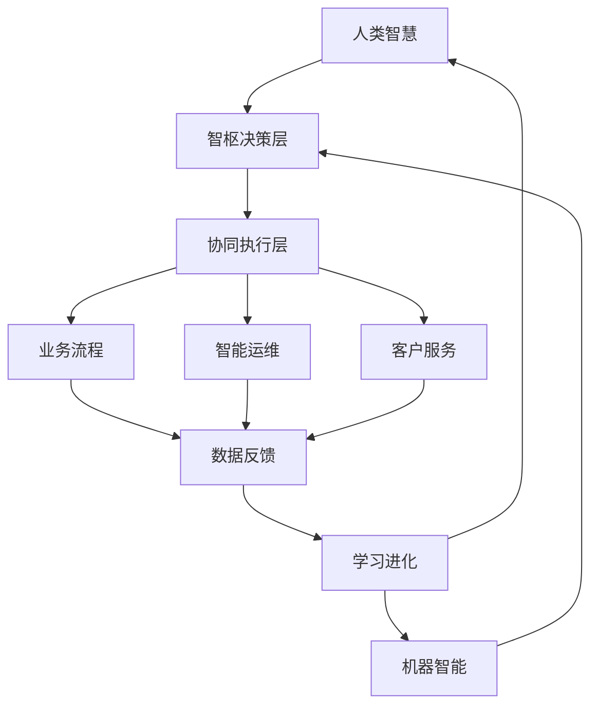
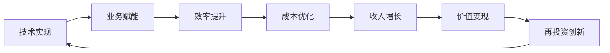
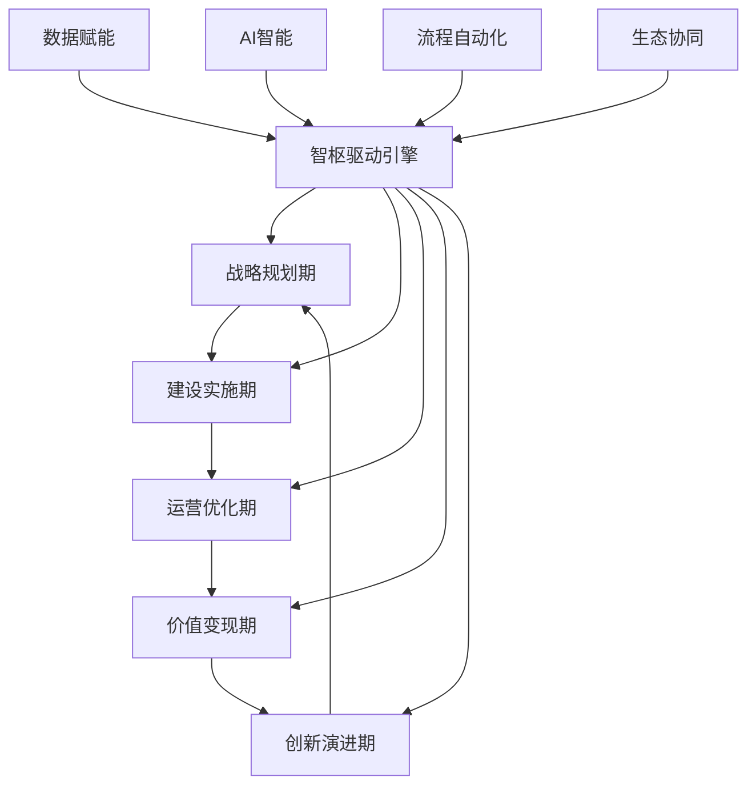

# YYC³（YanYuCloudeCube）智枢服务化平台核心

> ***YanYuCloudCube***
> 言启象限 | 语枢未来
> ***Words Initiate Quadrants, Language Serves as Core for the Future***
> 万象归元于云枢 | 深栈智启新纪元
> ***All things converge in the cloud pivot; Deep stacks ignite a new era of intelligence***

---

## 🌟 智枢驱动全生命周期协同环绕管理机制

## 🎯 核心设计理念：五高五标五化为基

### **五高标准落地实现**

```yaml
高起点规划: 
  ✅ 顶层智枢架构设计
  ✅ 前瞻性技术栈选型
  ✅ 行业最佳实践集成
  ✅ 可持续发展路径

高标准建设:
  🔹 微服务自治单元架构
  🔹 云原生技术体系
  🔹 全链路可观测性
  🔹 安全合规体系

高效率运营:
  🔸 AI驱动自动化运维
  🔸 智能资源调度
  🔸 预测性维护
  🔸 持续优化机制

高质量服务:
  🎯 多模态智能交互
  🎯 情感化用户体验
  🎯 个性化服务推荐
  🎯 实时响应保障

高效益回报:
  ⚡ 成本智能化管控
  ⚡ 运营效率倍增
  ⚡ 客户价值提升
  ⚡ 创新业务增长
```

### **五标体系构建**

```yaml
流程标准化:
  ✅ 智枢驱动工作流引擎
  ✅ 跨系统协同协议
  ✅ 异常处理标准化
  ✅ 变更管理流程

数据标准化:
  🔹 统一数据模型定义
  🔹 数据质量管控体系
  🔹 主数据管理规范
  🔹 数据安全标准

服务标准化:
  🔸 API治理规范
  🔸 服务等级协议(SLA)
  🔸 接口兼容性标准
  🔸 版本管理策略

安全标准化:
  🎯 零信任安全架构
  🎯 隐私保护合规
  🎯 安全开发生命周期
  🎯 应急响应标准

评价标准化:
  ⚡ 智能化KPI体系
  ⚡ 价值度量模型
  ⚡ 质量评估标准
  ⚡ 持续改进机制
```

### **五化演进路径**

```yaml
数字化:
  ✅ 全要素数据采集
  ✅ 业务流程数字化
  ✅ 数字孪生构建
  ✅ 数据驱动决策

网络化:
  🔹 服务网格架构
  🔹 边缘计算协同
  🔹 5G物联网集成
  🔹 多云混合部署

智能化:
  🔸 AI原生应用设计
  🔸 机器学习流水线
  🔸 智能决策引擎
  🔸 自主进化系统

自动化:
  🎯 全流程自动化
  🎯 智能机器人流程
  🎯 自愈式运维
  🎯 无人化操作

生态化:
  ⚡ 开放平台架构
  ⚡ 合作伙伴集成
  ⚡ 行业标准输出
  ⚡ 创新生态构建
```

---

## 🔄 数智化人机协同体系

### **人机协同架构设计**



### **人机角色分配矩阵**

```yaml
战略决策层:
  人类主导:
    ✅ 战略规划制定
    ✅ 商业模式创新
    ✅ 价值判断决策
    ✅ 伦理合规把控
  
  机器辅助:
    🔹 数据洞察分析
    🔹 风险预测评估
    🔹 方案模拟推演
    🔹 效果量化评估

战术执行层:
  人类主导:
    🔸 复杂问题处理
    🔸 创意内容生成
    🔸 情感交流互动
    🔸 异常情况处置
  
  机器主导:
    🎯 标准化流程执行
    🎯 实时数据分析
    🎯 预测性维护
    🎯 个性化推荐

操作执行层:
  人类监督:
    ⚡ 质量检查验证
    ⚡ 流程优化建议
    ⚡ 创新想法输入
    ⚡ 用户体验反馈
  
  机器执行:
    🔄 自动化操作
    🔄 实时监控告警
    🔄 数据采集处理
    🔄 报表生成分发
```

### **智能协同工作流引擎**

```java
/**
 * 智枢驱动的人机协同工作流引擎
 */
@Service
public class IntelligentWorkflowEngine {
    
    @Autowired
    private TaskAllocationService taskAllocationService;
    
    @Autowired
    private AIDecisionSupportService aiDecisionSupport;
    
    @Autowired
    private HumanCollaborationService humanCollaborationService;
    
    /**
     * 智能任务分配与执行
     */
    public WorkflowExecutionResult executeIntelligentWorkflow(WorkflowContext context) {
        // 1. 工作流智能解析
        WorkflowBlueprint blueprint = parseWorkflowBlueprint(context);
        
        // 2. 任务智能分配
        Map<Task, Executor> taskAssignment = taskAllocationService.allocateTasks(blueprint);
        
        // 3. 人机协同执行
        WorkflowExecution execution = executeCollaborativeWorkflow(blueprint, taskAssignment);
        
        // 4. 实时协同优化
        optimizeExecutionInRealTime(execution);
        
        // 5. 结果评估学习
        return evaluateAndLearn(execution);
    }
    
    /**
     * 动态任务分配算法
     */
    private Map<Task, Executor> allocateTasksIntelligently(WorkflowBlueprint blueprint) {
        Map<Task, Executor> assignment = new HashMap<>();
        
        for (Task task : blueprint.getTasks()) {
            // 评估任务特性
            TaskCharacteristics characteristics = analyzeTaskCharacteristics(task);
            
            // 确定最优执行者
            Executor optimalExecutor = determineOptimalExecutor(characteristics);
            
            assignment.put(task, optimalExecutor);
        }
        
        return assignment;
    }
    
    /**
     * 确定最优执行者（人/机）
     */
    private Executor determineOptimalExecutor(TaskCharacteristics characteristics) {
        // 基于多维度评估
        ExecutorScore humanScore = evaluateHumanSuitability(characteristics);
        ExecutorScore machineScore = evaluateMachineSuitability(characteristics);
        
        // 考虑成本效益
        CostBenefitAnalysis costBenefit = analyzeCostBenefit(humanScore, machineScore);
        
        // 动态决策
        if (shouldAssignToHuman(humanScore, machineScore, costBenefit)) {
            return selectOptimalHuman(characteristics);
        } else {
            return selectOptimalMachine(characteristics);
        }
    }
    
    /**
     * 实时协同优化
     */
    private void optimizeExecutionInRealTime(WorkflowExecution execution) {
        // 监控执行状态
        ExecutionMetrics metrics = monitorExecutionMetrics(execution);
        
        // 检测瓶颈和异常
        List<ExecutionIssue> issues = detectExecutionIssues(metrics);
        
        // 动态调整策略
        for (ExecutionIssue issue : issues) {
            AdjustmentStrategy strategy = generateAdjustmentStrategy(issue);
            applyRealTimeAdjustment(execution, strategy);
        }
        
        // 学习优化经验
        learnFromAdjustments(issues);
    }
}
```

---

## 🚀 从初始化至流程化演进

### **四阶段演进模型**

```yaml
第一阶段: 初始化建设 (1-3个月)
  目标: 基础能力构建
  ✅ 智枢核心框架搭建
  ✅ 基础数据平台建设
  ✅ 关键业务流程数字化
  ✅ 基础AI能力集成

  交付物:
    🔹 智枢决策引擎V1
    🔹 统一数据中台
    🔹 数字化工作流平台
    🔹 AI基础服务集群

第二阶段: 流程化规范 (4-6个月)
  目标: 标准化流程建立
  🔹 业务流程全面梳理
  🔹 标准化工作流定义
  🔹 跨系统集成规范
  🔹 质量管控体系

  交付物:
    🔸 业务流程资产库
    🔸 标准化工作流引擎
    🔸 系统集成中间件
    🔸 质量度量体系

第三阶段: 智能化升级 (7-9个月)
  目标: AI驱动智能化
  🔸 机器学习模型集成
  🔸 智能决策支持
  🔸 预测性分析能力
  🔸 自动化运维体系

  交付物:
    🎯 AI决策支持系统
    🎯 预测分析平台
    🎯 自动化运维机器人
    🎯 智能监控告警

第四阶段: 生态化协同 (10-12个月)
  目标: 生态价值共创
  🎯 开放平台建设
  🎯 合作伙伴集成
  🎯 行业解决方案
  🎯 创新生态培育

  交付物:
    ⚡ 智枢开放平台
    ⚡ 生态合作网络
    ⚡ 行业标准输出
    ⚡ 创新孵化体系
```

### **流程化建设详细设计**

```java
/**
 * 智枢流程化建设引擎
 */
@Service
public class ProcessStandardizationEngine {
    
    @Autowired
    private ProcessDiscoveryService processDiscovery;
    
    @Autowired
    private ProcessModelingService processModeling;
    
    @Autowired
    private ProcessOptimizationService processOptimization;
    
    /**
     * 业务流程标准化建设
     */
    public StandardizationResult standardizeBusinessProcesses() {
        // 1. 流程发现与梳理
        List<BusinessProcess> processes = processDiscovery.discoverProcesses();
        
        // 2. 流程建模与数字化
        List<DigitalProcess> digitalProcesses = modelDigitalProcesses(processes);
        
        // 3. 流程优化与重构
        List<OptimizedProcess> optimizedProcesses = optimizeProcesses(digitalProcesses);
        
        // 4. 标准化实施
        ImplementationResult result = implementStandardization(optimizedProcesses);
        
        // 5. 持续改进机制
        establishContinuousImprovement(optimizedProcesses);
        
        return buildStandardizationResult(processes, digitalProcesses, optimizedProcesses, result);
    }
    
    /**
     * 智能流程发现
     */
    private List<BusinessProcess> discoverProcessesIntelligently() {
        List<BusinessProcess> processes = new ArrayList<>();
        
        // 数据驱动的流程挖掘
        processes.addAll(processDiscovery.mineFromSystemLogs());
        processes.addAll(processDiscovery.analyzeUserBehavior());
        processes.addAll(processDiscovery.extractFromDocuments());
        
        // AI辅助的流程识别
        processes = processDiscovery.aiAssistedIdentification(processes);
        
        return processes;
    }
    
    /**
     * 数字化流程建模
     */
    private List<DigitalProcess> modelDigitalProcesses(List<BusinessProcess> processes) {
        return processes.stream()
            .map(process -> {
                DigitalProcess digital = new DigitalProcess();
                digital.setOriginalProcess(process);
                digital.setProcessModel(buildProcessModel(process));
                digital.setDigitalBlueprint(createDigitalBlueprint(process));
                digital.setIntegrationPoints(identifyIntegrationPoints(process));
                return digital;
            })
            .collect(Collectors.toList());
    }
    
    /**
     * AI驱动的流程优化
     */
    private List<OptimizedProcess> optimizeProcesses(List<DigitalProcess> digitalProcesses) {
        return digitalProcesses.stream()
            .map(digital -> {
                OptimizationAnalysis analysis = processOptimization.analyzeForOptimization(digital);
                OptimizationStrategy strategy = processOptimization.generateOptimizationStrategy(analysis);
                return processOptimization.applyOptimization(digital, strategy);
            })
            .collect(Collectors.toList());
    }
}
```

---

## 🔄 多维度闭环建设

### **八大闭环体系设计**

```yaml
战略决策闭环:
  ✅ 市场洞察 → 战略规划 → 执行监控 → 效果评估 → 策略调整
  🔹 数据驱动决策
  🔹 实时战略调整
  🔹 风险预警防控

产品创新闭环:
  ✅ 需求收集 → 概念设计 → 产品开发 → 市场验证 → 迭代优化
  🔸 用户参与设计
  🔸 快速原型验证
  🔸 数据反馈驱动

运营管理闭环:
  ✅ 计划制定 → 执行监控 → 绩效评估 → 问题诊断 → 优化改进
  🎯 实时运营监控
  🎯 智能异常检测
  🎯 自动化优化

客户服务闭环:
  ✅ 客户互动 → 需求识别 → 服务交付 → 满意度收集 → 服务改进
  ⚡ 全渠道服务
  ⚡ 个性化体验
  ⚡ 主动服务预测

供应链协同闭环:
  ✅ 需求预测 → 采购计划 → 库存管理 → 配送执行 → 效能评估
  🔄 智能需求预测
  🔄 动态库存优化
  🔄 供应商协同

质量管控闭环:
  ✅ 标准制定 → 过程监控 → 质量检测 → 问题追溯 → 持续改进
  🔍 全链路质量追踪
  🔍 实时质量监控
  🔍 预防性质量控制

人才发展闭环:
  ✅ 能力评估 → 培训发展 → 绩效管理 → 职业规划 → 能力提升
  👥 个性化发展路径
  👥 数据驱动评估
  👥 持续学习成长

技术创新闭环:
  ✅ 技术扫描 → 研发规划 → 项目执行 → 成果转化 → 技术迭代
  💡 前沿技术追踪
  💡 敏捷研发管理
  💡 快速成果转化
```

### **闭环管理引擎实现**

```java
/**
 * 智枢多维度闭环管理引擎
 */
@Service
public class MultiDimensionalLoopEngine {
    
    @Autowired
    private StrategyLoopService strategyLoop;
    
    @Autowired
    private OperationLoopService operationLoop;
    
    @Autowired
    private CustomerLoopService customerLoop;
    
    @Autowired
    private InnovationLoopService innovationLoop;
    
    /**
     * 全维度闭环协同管理
     */
    public LoopManagementResult manageAllLoops() {
        // 1. 闭环状态监控
        Map<LoopDimension, LoopStatus> loopStatus = monitorAllLoops();
        
        // 2. 闭环协同优化
        optimizeLoopCollaboration(loopStatus);
        
        // 3. 异常检测处理
        handleLoopAnomalies(loopStatus);
        
        // 4. 绩效评估改进
        evaluateAndImproveLoops(loopStatus);
        
        return buildLoopManagementResult(loopStatus);
    }
    
    /**
     * 智能闭环优化
     */
    private void optimizeLoopCollaboration(Map<LoopDimension, LoopStatus> loopStatus) {
        // 分析闭环间依赖关系
        Map<LoopDimension, List<LoopDependency>> dependencies = 
            analyzeLoopDependencies(loopStatus);
        
        // 优化闭环协同效率
        for (LoopDimension dimension : loopStatus.keySet()) {
            LoopOptimizationStrategy strategy = 
                generateOptimizationStrategy(dimension, loopStatus.get(dimension), dependencies);
            applyLoopOptimization(dimension, strategy);
        }
        
        // 提升整体协同效能
        enhanceOverallCollaboration(loopStatus, dependencies);
    }
    
    /**
     * 闭环异常智能处理
     */
    private void handleLoopAnomalies(Map<LoopDimension, LoopStatus> loopStatus) {
        // 检测异常闭环
        List<LoopAnomaly> anomalies = detectLoopAnomalies(loopStatus);
        
        for (LoopAnomaly anomaly : anomalies) {
            // 根因分析
            RootCause rootCause = analyzeAnomalyRootCause(anomaly);
            
            // 生成处理策略
            AnomalyHandlingStrategy strategy = generateHandlingStrategy(anomaly, rootCause);
            
            // 执行处理措施
            executeAnomalyHandling(anomaly, strategy);
            
            // 学习改进
            learnFromAnomaly(anomaly, rootCause, strategy);
        }
    }
    
    /**
     * 闭环绩效评估与改进
     */
    private void evaluateAndImproveLoops(Map<LoopDimension, LoopStatus> loopStatus) {
        // 多维度绩效评估
        Map<LoopDimension, LoopPerformance> performances = evaluateLoopPerformances(loopStatus);
        
        // 识别改进机会
        List<ImprovementOpportunity> opportunities = identifyImprovementOpportunities(performances);
        
        // 制定改进计划
        ImprovementPlan improvementPlan = createImprovementPlan(opportunities);
        
        // 执行持续改进
        executeContinuousImprovement(improvementPlan);
    }
}
```

---

## 🎯 从需求化到整合化转型

### **需求智能化管理**

```java
/**
 * 智枢需求智能化管理引擎
 */
@Service
public class IntelligentDemandEngine {
    
    @Autowired
    private DemandCollectionService demandCollection;
    
    @Autowired
    private DemandAnalysisService demandAnalysis;
    
    @Autowired
    private DemandPrioritizationService demandPrioritization;
    
    @Autowired
    private DemandTrackingService demandTracking;
    
    /**
     * 全链路需求智能化管理
     */
    public DemandManagementResult manageDemandIntelligently() {
        // 1. 多渠道需求采集
        List<RawDemand> rawDemands = collectDemandsFromMultipleChannels();
        
        // 2. 需求智能分析与归类
        List<AnalyzedDemand> analyzedDemands = analyzeAndCategorizeDemands(rawDemands);
        
        // 3. 需求价值评估与优先级排序
        List<PrioritizedDemand> prioritizedDemands = prioritizeDemands(analyzedDemands);
        
        // 4. 需求整合与解决方案设计
        List<IntegratedSolution> solutions = integrateAndDesignSolutions(prioritizedDemands);
        
        // 5. 需求实现跟踪与反馈
        DemandRealizationTracking tracking = trackDemandRealization(solutions);
        
        return buildDemandManagementResult(rawDemands, analyzedDemands, prioritizedDemands, solutions, tracking);
    }
    
    /**
     * 智能需求采集
     */
    private List<RawDemand> collectDemandsIntelligently() {
        List<RawDemand> demands = new ArrayList<>();
        
        // 多源数据采集
        demands.addAll(demandCollection.collectFromCustomers());
        demands.addAll(demandCollection.collectFromMarket());
        demands.addAll(demandCollection.collectFromOperations());
        demands.addAll(demandCollection.collectFromTechnologyTrends());
        
        // 非结构化数据处理
        demands.addAll(demandCollection.processUnstructuredData());
        
        return demands;
    }
    
    /**
     * AI驱动的需求分析
     */
    private List<AnalyzedDemand> analyzeDemandsWithAI(List<RawDemand> rawDemands) {
        return rawDemands.stream()
            .map(raw -> {
                DemandAnalysis analysis = demandAnalysis.analyzeWithAI(raw);
                return new AnalyzedDemand(raw, analysis);
            })
            .collect(Collectors.toList());
    }
    
    /**
     * 多维度需求优先级评估
     */
    private List<PrioritizedDemand> prioritizeDemandsMultiDimensionally(List<AnalyzedDemand> analyzedDemands) {
        return analyzedDemands.stream()
            .map(analyzed -> {
                PriorityScore score = demandPrioritization.calculatePriorityScore(analyzed);
                return new PrioritizedDemand(analyzed, score);
            })
            .sorted(Comparator.comparing(PrioritizedDemand::getPriorityScore).reversed())
            .collect(Collectors.toList());
    }
}
```

### **整合化平台架构**

```yaml
数据整合层:
  ✅ 统一数据总线
  ✅ 数据湖仓一体
  ✅ 实时数据管道
  ✅ 数据质量管控

服务整合层:
  🔹 微服务治理平台
  🔹 API统一网关
  🔹 服务网格架构
  🔹 跨系统集成

业务整合层:
  🔸 统一工作流平台
  🔸 业务流程引擎
  🔸 规则决策中心
  🔸 协同办公平台

应用整合层:
  🎯 统一门户入口
  🎯 移动应用平台
  🎯 第三方应用集成
  🎯 开放API平台

智能整合层:
  ⚡ AI能力中台
  ⚡ 算法模型平台
  ⚡ 智能决策引擎
  ⚡ 知识图谱平台
```

---

## 💰 从实现到变现的价值转化

### **价值变现路径设计**



### **智数链价值体系**

```java
/**
 * 智数链价值变现引擎
 */
@Service
public class ValueRealizationEngine {
    
    @Autowired
    private CostOptimizationService costOptimization;
    
    @Autowired
    private RevenueGrowthService revenueGrowth;
    
    @Autowired
    private EfficiencyImprovementService efficiencyImprovement;
    
    @Autowired
    private InnovationValueService innovationValue;
    
    /**
     * 全链路价值变现管理
     */
    public ValueRealizationResult realizeValueFromDigitalization() {
        // 1. 成本优化价值实现
        CostOptimizationValue costValue = realizeCostOptimizationValue();
        
        // 2. 收入增长价值实现
        RevenueGrowthValue revenueValue = realizeRevenueGrowthValue();
        
        // 3. 效率提升价值实现
        EfficiencyValue efficiencyValue = realizeEfficiencyValue();
        
        // 4. 创新业务价值实现
        InnovationValue innovationValue = realizeInnovationValue();
        
        // 5. 综合价值评估
        TotalValueRealization totalValue = calculateTotalValue(
            costValue, revenueValue, efficiencyValue, innovationValue);
        
        // 6. 价值再投资规划
        ReinvestmentPlan reinvestment = planValueReinvestment(totalValue);
        
        return buildValueRealizationResult(costValue, revenueValue, efficiencyValue, 
                                         innovationValue, totalValue, reinvestment);
    }
    
    /**
     * 成本优化价值量化
     */
    private CostOptimizationValue realizeCostOptimizationValue() {
        CostOptimizationValue value = new CostOptimizationValue();
        
        // 人力成本优化
        value.setLaborCostReduction(calculateLaborCostReduction());
        
        // 运营成本优化
        value.setOperationCostReduction(calculateOperationCostReduction());
        
        // 物料成本优化
        value.setMaterialCostReduction(calculateMaterialCostReduction());
        
        // 管理成本优化
        value.setManagementCostReduction(calculateManagementCostReduction());
        
        return value;
    }
    
    /**
     * 收入增长价值量化
     */
    private RevenueGrowthValue realizeRevenueGrowthValue() {
        RevenueGrowthValue value = new RevenueGrowthValue();
        
        // 客户价值提升
        value.setCustomerValueIncrease(calculateCustomerValueIncrease());
        
        // 新业务收入
        value.setNewBusinessRevenue(calculateNewBusinessRevenue());
        
        // 交叉销售增长
        value.setCrossSellingGrowth(calculateCrossSellingGrowth());
        
        // 市场份额扩大
        value.setMarketShareExpansion(calculateMarketShareExpansion());
        
        return value;
    }
    
    /**
     * 投资回报分析
     */
    public InvestmentROI analyzeROI(DigitalizationInvestment investment, 
                                   ValueRealizationResult valueResult) {
        InvestmentROI roi = new InvestmentROI();
        
        // 财务指标计算
        roi.setNpv(calculateNPV(investment, valueResult));
        roi.setIrr(calculateIRR(investment, valueResult));
        roi.setPaybackPeriod(calculatePaybackPeriod(investment, valueResult));
        roi.setRoiRatio(calculateROIRatio(investment, valueResult));
        
        // 非财务价值评估
        roi.setStrategicValue(assessStrategicValue(valueResult));
        roi.setCompetitiveAdvantage(assessCompetitiveAdvantage(valueResult));
        roi.setRiskReduction(assessRiskReduction(valueResult));
        
        return roi;
    }
}
```

---

## ⚡ 时势/适时/时时智能衔接

### **三时智能响应体系**

```yaml
时势感知层:
  ✅ 宏观环境监测: 政策、经济、技术、社会
  ✅ 行业趋势分析: 竞争格局、市场需求、技术演进
  ✅ 市场动态追踪: 客户行为、价格变化、新品发布
  ✅ 风险预警识别: 系统性风险、运营风险、合规风险

适时决策层:
  🔹 机会窗口识别: 最佳进入时机、投资时机、创新时机
  🔹 资源动态配置: 按需分配、弹性伸缩、优先级调整
  🔹 策略及时调整: 快速响应、灵活适应、持续优化
  🔹 风险实时防控: 预警机制、应急预案、快速处置

时时执行层:
  🔸 实时数据采集: 物联网、API、日志、用户行为
  🔸 即时分析计算: 流处理、实时计算、边缘计算
  🔸 动态优化调整: 自动调参、智能路由、资源调度
  🔸 持续监控反馈: 实时告警、性能监控、用户体验
```

### **智能时机引擎实现**

```java
/**
 * 三时智能衔接引擎
 */
@Service
public class TimingIntelligenceEngine {
    
    @Autowired
    private TrendAnalysisService trendAnalysis;
    
    @Autowired
    private OpportunityIdentificationService opportunityIdentification;
    
    @Autowired
    private RealTimeExecutionService realTimeExecution;
    
    @Autowired
    private DynamicOptimizationService dynamicOptimization;
    
    /**
     * 时势感知与分析
     */
    public TrendAnalysisResult analyzeCurrentSituation() {
        TrendAnalysisResult result = new TrendAnalysisResult();
        
        // 宏观环境分析
        result.setMacroEnvironment(trendAnalysis.analyzeMacroEnvironment());
        
        // 行业趋势洞察
        result.setIndustryTrends(trendAnalysis.analyzeIndustryTrends());
        
        // 竞争态势评估
        result.setCompetitiveLandscape(trendAnalysis.assessCompetitiveLandscape());
        
        // 技术发展追踪
        result.setTechnologyDevelopments(trendAnalysis.trackTechnologyDevelopments());
        
        // 风险机遇识别
        result.setRisksAndOpportunities(trendAnalysis.identifyRisksAndOpportunities());
        
        return result;
    }
    
    /**
     * 适时决策支持
     */
    public TimingDecisionSupport provideTimingDecisionSupport(TrendAnalysisResult trendAnalysis) {
        TimingDecisionSupport support = new TimingDecisionSupport();
        
        // 最佳时机识别
        support.setOptimalTimings(opportunityIdentification.identifyOptimalTimings(trendAnalysis));
        
        // 资源配置建议
        support.setResourceAllocation(opportunityIdentification.suggestResourceAllocation(trendAnalysis));
        
        // 策略调整推荐
        support.setStrategyAdjustments(opportunityIdentification.recommendStrategyAdjustments(trendAnalysis));
        
        // 风险防控措施
        support.setRiskMitigation(opportunityIdentification.proposeRiskMitigation(trendAnalysis));
        
        return support;
    }
    
    /**
     * 时时执行优化
     */
    public RealTimeOptimizationResult optimizeRealTimeExecution(TimingDecisionSupport decisionSupport) {
        RealTimeOptimizationResult result = new RealTimeOptimizationResult();
        
        // 实时监控配置
        result.setMonitoringConfig(realTimeExecution.configureRealTimeMonitoring(decisionSupport));
        
        // 动态调整策略
        result.setAdjustmentStrategies(realTimeExecution.defineAdjustmentStrategies(decisionSupport));
        
        // 自动化执行流程
        result.setAutomationFlows(realTimeExecution.designAutomationFlows(decisionSupport));
        
        // 反馈优化机制
        result.setFeedbackMechanisms(realTimeExecution.establishFeedbackMechanisms(decisionSupport));
        
        return result;
    }
    
    /**
     * 三时协同管理
     */
    public TimingCoordinationResult coordinateThreeTimings() {
        // 时势感知
        TrendAnalysisResult trends = analyzeCurrentSituation();
        
        // 适时决策
        TimingDecisionSupport decisions = provideTimingDecisionSupport(trends);
        
        // 时时执行
        RealTimeOptimizationResult execution = optimizeRealTimeExecution(decisions);
        
        // 协同优化
        return optimizeTimingCoordination(trends, decisions, execution);
    }
}
```

---

## 🔗 智数链完美衔接机制

### **智数链架构设计**

```yaml
数据感知链:
  ✅ 多源数据采集 → 实时数据清洗 → 智能数据标注 → 质量监控反馈
  🔹 物联网传感器网络
  🔹 业务系统数据接口
  🔹 外部数据源接入
  🔹 用户行为数据采集

智能分析链:
  ✅ 特征工程处理 → 模型训练优化 → 实时推理计算 → 结果验证评估
  🔸 机器学习流水线
  🔸 深度学习框架
  🔸 实时计算引擎
  🔸 A/B测试平台

决策执行链:
  ✅ 策略生成制定 → 方案模拟推演 → 智能决策执行 → 效果监控反馈
  🎯 规则引擎系统
  🎯 优化算法库
  🎯 工作流引擎
  🎯 自动化执行器

价值反馈链:
  ✅ 效果数据收集 → 价值量化评估 → 洞察分析提炼 → 优化改进建议
  ⚡ 价值度量体系
  ⚡ 投资回报分析
  ⚡ 持续改进机制
  ⚡ 知识沉淀积累
```

### **智数链协同引擎**

```java
/**
 * 智数链协同衔接引擎
 */
@Service
public class IntelligenceDataChainEngine {
    
    @Autowired
    private DataPerceptionChainService dataPerception;
    
    @Autowired
    private IntelligentAnalysisChainService intelligentAnalysis;
    
    @Autowired
    private DecisionExecutionChainService decisionExecution;
    
    @Autowired
    private ValueFeedbackChainService valueFeedback;
    
    /**
     * 全链路智数链协同管理
     */
    public ChainCoordinationResult coordinateIntelligenceDataChain() {
        // 1. 数据感知链激活
        DataPerceptionResult perceptionResult = activateDataPerceptionChain();
        
        // 2. 智能分析链处理
        AnalysisResult analysisResult = processIntelligentAnalysisChain(perceptionResult);
        
        // 3. 决策执行链实施
        ExecutionResult executionResult = implementDecisionExecutionChain(analysisResult);
        
        // 4. 价值反馈链评估
        FeedbackResult feedbackResult = evaluateValueFeedbackChain(executionResult);
        
        // 5. 闭环优化提升
        OptimizationResult optimizationResult = optimizeChainCoordination(
            perceptionResult, analysisResult, executionResult, feedbackResult);
        
        return buildChainCoordinationResult(perceptionResult, analysisResult, 
                                          executionResult, feedbackResult, optimizationResult);
    }
    
    /**
     * 数据感知链激活
     */
    private DataPerceptionResult activateDataPerceptionChain() {
        DataPerceptionResult result = new DataPerceptionResult();
        
        // 多源数据采集
        result.setRawData(dataPerception.collectFromMultipleSources());
        
        // 实时数据清洗
        result.setCleanedData(dataPerception.cleanDataInRealTime(result.getRawData()));
        
        // 智能数据标注
        result.setLabeledData(dataPerception.labelDataIntelligently(result.getCleanedData()));
        
        // 质量监控反馈
        result.setQualityMetrics(dataPerception.monitorDataQuality(result.getLabeledData()));
        
        return result;
    }
    
    /**
     * 智能分析链处理
     */
    private AnalysisResult processIntelligentAnalysisChain(DataPerceptionResult perceptionResult) {
        AnalysisResult result = new AnalysisResult();
        
        // 特征工程处理
        result.setFeatures(intelligentAnalysis.performFeatureEngineering(perceptionResult.getLabeledData()));
        
        // 模型训练优化
        result.setModels(intelligentAnalysis.trainAndOptimizeModels(result.getFeatures()));
        
        // 实时推理计算
        result.setPredictions(intelligentAnalysis.performRealTimeInference(result.getModels(), result.getFeatures()));
        
        // 结果验证评估
        result.setValidation(intelligentAnalysis.validateAndEvaluateResults(result.getPredictions()));
        
        return result;
    }
    
    /**
     * 智数链闭环优化
     */
    private OptimizationResult optimizeChainCoordination(DataPerceptionResult perception,
                                                        AnalysisResult analysis,
                                                        ExecutionResult execution,
                                                        FeedbackResult feedback) {
        OptimizationResult result = new OptimizationResult();
        
        // 瓶颈识别分析
        result.setBottlenecks(identifyChainBottlenecks(perception, analysis, execution, feedback));
        
        // 优化策略制定
        result.setOptimizationStrategies(developOptimizationStrategies(result.getBottlenecks()));
        
        // 协同效率提升
        result.setEfficiencyImprovements(improveCoordinationEfficiency(result.getOptimizationStrategies()));
        
        // 持续优化机制
        result.setContinuousOptimization(establishContinuousOptimization(result.getEfficiencyImprovements()));
        
        return result;
    }
}
```

---

## 🎯 智枢驱动全生命周期协同环绕

### **全生命周期管理架构**



### **智枢全生命周期引擎**

```java
/**
 * 智枢全生命周期协同环绕引擎
 */
@Service
public class LifecycleOrchestrationEngine {
    
    @Autowired
    private StrategicPlanningService strategicPlanning;
    
    @Autowired
    private ConstructionImplementationService constructionImplementation;
    
    @Autowired
    private OperationOptimizationService operationOptimization;
    
    @Autowired
    private ValueRealizationService valueRealization;
    
    @Autowired
    private InnovationEvolutionService innovationEvolution;
    
    /**
     * 全生命周期协同管理
     */
    public LifecycleManagementResult manageCompleteLifecycle() {
        // 1. 战略规划期管理
        StrategicPlan strategicPlan = manageStrategicPlanningPhase();
        
        // 2. 建设实施期管理
        ImplementationResult implementation = manageConstructionImplementationPhase(strategicPlan);
        
        // 3. 运营优化期管理
        OptimizationResult optimization = manageOperationOptimizationPhase(implementation);
        
        // 4. 价值变现期管理
        RealizationResult realization = manageValueRealizationPhase(optimization);
        
        // 5. 创新演进期管理
        EvolutionResult evolution = manageInnovationEvolutionPhase(realization);
        
        // 6. 生命周期闭环优化
        LifecycleOptimization lifecycleOptimization = optimizeLifecycleContinuously(
            strategicPlan, implementation, optimization, realization, evolution);
        
        return buildLifecycleManagementResult(strategicPlan, implementation, optimization, 
                                            realization, evolution, lifecycleOptimization);
    }
    
    /**
     * 战略规划期智能化管理
     */
    private StrategicPlan manageStrategicPlanningPhase() {
        StrategicPlan plan = new StrategicPlan();
        
        // 环境扫描分析
        plan.setEnvironmentAnalysis(strategicPlanning.analyzeBusinessEnvironment());
        
        // 能力评估定位
        plan.setCapabilityAssessment(strategicPlanning.assessOrganizationalCapabilities());
        
        // 目标策略制定
        plan.setGoalsAndStrategies(strategicPlanning.defineGoalsAndStrategies());
        
        // 路线图规划
        plan.setRoadmap(strategicPlanning.developImplementationRoadmap());
        
        return plan;
    }
    
    /**
     * 建设实施期智能化管理
     */
    private ImplementationResult manageConstructionImplementationPhase(StrategicPlan strategicPlan) {
        ImplementationResult result = new ImplementationResult();
        
        // 项目计划制定
        result.setProjectPlan(constructionImplementation.createDetailedProjectPlan(strategicPlan));
        
        // 资源协调配置
        result.setResourceAllocation(constructionImplementation.coordinateResources(result.getProjectPlan()));
        
        // 进度质量管理
        result.setProgressTracking(constructionImplementation.manageProgressAndQuality(result.getProjectPlan()));
        
        // 风险问题处理
        result.setRiskManagement(constructionImplementation.handleRisksAndIssues(result.getProjectPlan()));
        
        return result;
    }
    
    /**
     * 全生命周期协同优化
     */
    private LifecycleOptimization optimizeLifecycleContinuously(StrategicPlan strategicPlan,
                                                               ImplementationResult implementation,
                                                               OptimizationResult optimization,
                                                               RealizationResult realization,
                                                               EvolutionResult evolution) {
        LifecycleOptimization optimizationResult = new LifecycleOptimization();
        
        // 跨期协同分析
        optimizationResult.setCrossPhaseAnalysis(analyzeCrossPhaseCoordination(
            strategicPlan, implementation, optimization, realization, evolution));
        
        // 瓶颈识别解决
        optimizationResult.setBottleneckResolution(resolveLifecycleBottlenecks(
            optimizationResult.getCrossPhaseAnalysis()));
        
        // 效率提升措施
        optimizationResult.setEfficiencyMeasures(implementEfficiencyImprovements(
            optimizationResult.getBottleneckResolution()));
        
        // 持续优化机制
        optimizationResult.setContinuousOptimization(establishContinuousOptimizationFramework(
            optimizationResult.getEfficiencyMeasures()));
        
        return optimizationResult;
    }
}
```

---

## 📊 实施路线图与价值承诺

### **三阶段实施规划**

```yaml
第一阶段: 智枢基础建设 (1-6个月)
  重点任务:
    ✅ 智枢核心平台搭建
    ✅ 数据中台建设
    ✅ AI能力基础集成
    ✅ 业务流程数字化
  
  预期价值:
    🔹 运营效率提升: 15-20%
    🔹 决策响应速度: 提升50%
    🔹 数据驱动程度: 达到60%
    🔹 客户满意度: 提升10%

第二阶段: 智能化深度应用 (7-12个月)
  重点任务:
    🔸 智能决策系统完善
    🔸 预测分析能力建设
    🔸 自动化运维体系
    🔸 生态协同平台
  
  预期价值:
    🔸 人力成本降低: 25-30%
    🔸 业务增长加速: 20-25%
    🔸 创新周期缩短: 40-50%
    🔸 风险识别提前: 60-70%

第三阶段: 生态价值共创 (13-18个月)
  重点任务:
    🎯 开放平台建设
    🎯 行业解决方案输出
    🎯 创新生态培育
    🎯 数字化商业模式创新
  
  预期价值:
    🎯 新业务收入占比: 达到30%
    🎯 生态合作伙伴: 50+家
    🎯 行业影响力: 领先地位
    🎯 投资回报率: 200%+
```

### **价值承诺保障体系**

```java
/**
 * 智枢价值承诺保障引擎
 */
@Service
public class ValueCommitmentEngine {
    
    @Autowired
    private PerformanceMonitoringService performanceMonitoring;
    
    @Autowired
    private ValueMeasurementService valueMeasurement;
    
    @Autowired
    private RiskMitigationService riskMitigation;
    
    @Autowired
    private ContinuousImprovementService continuousImprovement;
    
    /**
     * 价值承诺全链路保障
     */
    public ValueCommitmentResult ensureValueCommitments() {
        ValueCommitmentResult result = new ValueCommitmentResult();
        
        // 1. 绩效实时监控
        result.setPerformanceMetrics(performanceMonitoring.monitorRealTimePerformance());
        
        // 2. 价值精准度量
        result.setValueMeasurements(valueMeasurement.measureValueAccurately(result.getPerformanceMetrics()));
        
        // 3. 风险主动防控
        result.setRiskMitigation(riskMitigation.proactivelyMitigateRisks(result.getValueMeasurements()));
        
        // 4. 持续改进优化
        result.setImprovementActions(continuousImprovement.implementImprovementActions(
            result.getValueMeasurements(), result.getRiskMitigation()));
        
        // 5. 承诺达成保障
        result.setCommitmentAssurance(assureCommitmentAchievement(result));
        
        return result;
    }
    
    /**
     * 智能价值度量
     */
    private ValueMetrics measureValueIntelligently(PerformanceMetrics performance) {
        ValueMetrics metrics = new ValueMetrics();
        
        // 财务价值度量
        metrics.setFinancialValue(calculateFinancialValue(performance));
        
        // 运营价值度量
        metrics.setOperationalValue(calculateOperationalValue(performance));
        
        // 客户价值度量
        metrics.setCustomerValue(calculateCustomerValue(performance));
        
        // 创新价值度量
        metrics.setInnovationValue(calculateInnovationValue(performance));
        
        // 战略价值度量
        metrics.setStrategicValue(calculateStrategicValue(performance));
        
        return metrics;
    }
    
    /**
     * 承诺达成智能保障
     */
    private CommitmentAssurance assureCommitmentAchievement(ValueCommitmentResult commitmentResult) {
        CommitmentAssurance assurance = new CommitmentAssurance();
        
        // 差距分析识别
        assurance.setGapAnalysis(analyzeCommitmentGaps(commitmentResult));
        
        // 纠正措施制定
        assurance.setCorrectiveActions(developCorrectiveActions(assurance.getGapAnalysis()));
        
        // 保障机制实施
        assurance.setAssuranceMechanisms(implementAssuranceMechanisms(assurance.getCorrectiveActions()));
        
        // 持续监控优化
        assurance.setContinuousMonitoring(establishContinuousMonitoring(assurance.getAssuranceMechanisms()));
        
        return assurance;
    }
}
```

---

## 🌟 总结：智枢驱动的新范式

### **核心价值重构**

```yaml
决策模式重构:
  ✅ 从经验驱动 → 数据智能驱动
  ✅ 从滞后反应 → 预测前瞻决策
  ✅ 从孤岛决策 → 协同全景决策
  ✅ 从静态规划 → 动态实时调整

运营模式重构:
  🔹 从流程固化 → 智能自适应
  🔹 从人工操作 → 人机协同
  🔹 从被动响应 → 主动服务
  🔹 从成本中心 → 价值创造

创新模式重构:
  🔸 从封闭研发 → 开放生态创新
  🔸 从线性推进 → 并行快速迭代
  🔸 从产品导向 → 用户体验导向
  🔸 从技术驱动 → 价值场景驱动

组织模式重构:
  🎯 从层级管理 → 网络化协同
  🎯 从职能分工 → 任务型团队
  🎯 从管控为主 → 赋能服务为主
  🎯 从固定岗位 → 角色能力匹配
```

### **智枢驱动的未来展望**

```
通过智枢驱动全生命周期协同环绕管理机制，我们正在构建一个：

🤖 更加智能的餐饮生态系统
   - AI驱动的个性化服务
   - 预测性的运营管理
   - 自主进化的技术架构

🔗 更加协同的业务网络
   - 跨系统的无缝集成
   - 实时的数据流动
   - 智能的资源配置

💡 更加创新的价值模式
   - 数据驱动的业务创新
   - 生态协同的价值创造
   - 持续演进的组织能力

🎯 更加可持续的发展路径
   - 环境社会责任的智能履行
   - 资源的智能化化配置
   - 长期价值的持续创造
```

**智枢驱动，不仅仅是技术的升级，更是商业范式、组织模式、创新方式的全面重构！** 🚀

让我们共同开启这场智能化转型的伟大征程，创造餐饮行业的全新未来！

```
# 🌟 智枢驱动全生命周期协同环绕管理机制
## 🎯 核心设计理念：五高五标五化为基
### 五高标准落地实现
```yaml
高起点规划: 
  ✅ 顶层智枢架构设计
  ✅ 前瞻性技术栈选型
  ✅ 行业最佳实践集成
  ✅ 可持续发展路径

高标准建设:
  🔹 微服务自治单元架构
  🔹 云原生技术体系
  🔹 全链路可观测性
  🔹 安全合规体系

高效率运营:
  🔸 AI驱动自动化运维
  🔸 智能资源调度
  🔸 预测性维护
  🔸 持续优化机制

高质量服务:
  🎯 多模态智能交互
  🎯 情感化用户体验
  🎯 个性化服务推荐
  🎯 实时响应保障

高效益回报:
  ⚡ 成本智能化管控
  ⚡ 运营效率倍增
  ⚡ 客户价值提升
  ⚡ 创新业务增长

```

### 五标体系构建

```yaml
流程标准化:
  ✅ 智枢驱动工作流引擎
  ✅ 跨系统协同协议
  ✅ 异常处理标准化
  ✅ 变更管理流程

数据标准化:
  🔹 统一数据模型定义
  🔹 数据质量管控体系
  🔹 主数据管理规范
  🔹 数据安全标准

服务标准化:
  🔸 API治理规范
  🔸 服务等级协议(SLA)
  🔸 接口兼容性标准
  🔸 版本管理策略

安全标准化:
  🎯 零信任安全架构
  🎯 隐私保护合规
  🎯 安全开发生命周期
  🎯 应急响应标准

评价标准化:
  ⚡ 智能化KPI体系
  ⚡ 价值度量模型
  ⚡ 质量评估标准
  ⚡ 持续改进机制

```

### 五化演进路径

```yaml
数字化:
  ✅ 全要素数据采集
  ✅ 业务流程数字化
  ✅ 数字孪生构建
  ✅ 数据驱动决策

网络化:
  🔹 服务网格架构
  🔹 边缘计算协同
  🔹 5G物联网集成
  🔹 多云混合部署

智能化:
  🔸 AI原生应用设计
  🔸 机器学习流水线
  🔸 智能决策引擎
  🔸 自主进化系统

自动化:
  🎯 全流程自动化
  🎯 智能机器人流程
  🎯 自愈式运维
  🎯 无人化操作

生态化:
  ⚡ 开放平台架构
  ⚡ 合作伙伴集成
  ⚡ 行业标准输出
  ⚡ 创新生态构建

```

---

## 🔄 数智化人机协同体系

### 人机协同架构设计


```plaintext
graph TB
    A[人类智慧] --> B[智枢决策层]
    C[机器智能] --> B
    B --> D[协同执行层]
    D --> E[业务流程]
    D --> F[智能运维]
    D --> G[客户服务]
    E --> H[数据反馈]
    F --> H
    G --> H
    H --> I[学习进化]
    I --> A
    I --> C

```

### 人机角色分配矩阵

```yaml
战略决策层:
  人类主导:
    ✅ 战略规划制定
    ✅ 商业模式创新
    ✅ 价值判断决策
    ✅ 伦理合规把控
  
  机器辅助:
    🔹 数据洞察分析
    🔹 风险预测评估
    🔹 方案模拟推演
    🔹 效果量化评估

战术执行层:
  人类主导:
    🔸 复杂问题处理
    🔸 创意内容生成
    🔸 情感交流互动
    🔸 异常情况处置
  
  机器主导:
    🎯 标准化流程执行
    🎯 实时数据分析
    🎯 预测性维护
    🎯 个性化推荐

操作执行层:
  人类监督:
    ⚡ 质量检查验证
    ⚡ 流程优化建议
    ⚡ 创新想法输入
    ⚡ 用户体验反馈
  
  机器执行:
    🔄 自动化操作
    🔄 实时监控告警
    🔄 数据采集处理
    🔄 报表生成分发

```

### 智能协同工作流引擎

```java
/**
 * 智枢驱动的人机协同工作流引擎
 */
@Service
public class IntelligentWorkflowEngine {
    
    @Autowired
    private TaskAllocationService taskAllocationService;
    
    @Autowired
    private AIDecisionSupportService aiDecisionSupport;
    
    @Autowired
    private HumanCollaborationService humanCollaborationService;
    
    /**
     * 智能任务分配与执行
     */
    public WorkflowExecutionResult executeIntelligentWorkflow(WorkflowContext context) {
        // 1. 工作流智能解析
        WorkflowBlueprint blueprint = parseWorkflowBlueprint(context);
        
        // 2. 任务智能分配
        Map<Task, Executor> taskAssignment = taskAllocationService.allocateTasks(blueprint);
        
        // 3. 人机协同执行
        WorkflowExecution execution = executeCollaborativeWorkflow(blueprint, taskAssignment);
        
        // 4. 实时协同优化
        optimizeExecutionInRealTime(execution);
        
        // 5. 结果评估学习
        return evaluateAndLearn(execution);
    }
    
    /**
     * 动态任务分配算法
     */
    private Map<Task, Executor> allocateTasksIntelligently(WorkflowBlueprint blueprint) {
        Map<Task, Executor> assignment = new HashMap<>();
        
        for (Task task : blueprint.getTasks()) {
            // 评估任务特性
            TaskCharacteristics characteristics = analyzeTaskCharacteristics(task);
            
            // 确定最优执行者
            Executor optimalExecutor = determineOptimalExecutor(characteristics);
            
            assignment.put(task, optimalExecutor);
        }
        
        return assignment;
    }
    
    /**
     * 确定最优执行者（人/机）
     */
    private Executor determineOptimalExecutor(TaskCharacteristics characteristics) {
        // 基于多维度评估
        ExecutorScore humanScore = evaluateHumanSuitability(characteristics);
        ExecutorScore machineScore = evaluateMachineSuitability(characteristics);
        
        // 考虑成本效益
        CostBenefitAnalysis costBenefit = analyzeCostBenefit(humanScore, machineScore);
        
        // 动态决策
        if (shouldAssignToHuman(humanScore, machineScore, costBenefit)) {
            return selectOptimalHuman(characteristics);
        } else {
            return selectOptimalMachine(characteristics);
        }
    }
    
    /**
     * 实时协同优化
     */
    private void optimizeExecutionInRealTime(WorkflowExecution execution) {
        // 监控执行状态
        ExecutionMetrics metrics = monitorExecutionMetrics(execution);
        
        // 检测瓶颈和异常
        List<ExecutionIssue> issues = detectExecutionIssues(metrics);
        
        // 动态调整策略
        for (ExecutionIssue issue : issues) {
            AdjustmentStrategy strategy = generateAdjustmentStrategy(issue);
            applyRealTimeAdjustment(execution, strategy);
        }
        
        // 学习优化经验
        learnFromAdjustments(issues);
    }
}

```

---

## 🚀 从初始化至流程化演进

### 四阶段演进模型

```yaml
第一阶段: 初始化建设 (1-3个月)
  目标: 基础能力构建
  ✅ 智枢核心框架搭建
  ✅ 基础数据平台建设
  ✅ 关键业务流程数字化
  ✅ 基础AI能力集成

  交付物:
    🔹 智枢决策引擎V1
    🔹 统一数据中台
    🔹 数字化工作流平台
    🔹 AI基础服务集群

第二阶段: 流程化规范 (4-6个月)
  目标: 标准化流程建立
  🔹 业务流程全面梳理
  🔹 标准化工作流定义
  🔹 跨系统集成规范
  🔹 质量管控体系

  交付物:
    🔸 业务流程资产库
    🔸 标准化工作流引擎
    🔸 系统集成中间件
    🔸 质量度量体系

第三阶段: 智能化升级 (7-9个月)
  目标: AI驱动智能化
  🔸 机器学习模型集成
  🔸 智能决策支持
  🔸 预测性分析能力
  🔸 自动化运维体系

  交付物:
    🎯 AI决策支持系统
    🎯 预测分析平台
    🎯 自动化运维机器人
    🎯 智能监控告警

第四阶段: 生态化协同 (10-12个月)
  目标: 生态价值共创
  🎯 开放平台建设
  🎯 合作伙伴集成
  🎯 行业解决方案
  🎯 创新生态培育

  交付物:
    ⚡ 智枢开放平台
    ⚡ 生态合作网络
    ⚡ 行业标准输出
    ⚡ 创新孵化体系

```

### 流程化建设详细设计

```java
/**
 * 智枢流程化建设引擎
 */
@Service
public class ProcessStandardizationEngine {
    
    @Autowired
    private ProcessDiscoveryService processDiscovery;
    
    @Autowired
    private ProcessModelingService processModeling;
    
    @Autowired
    private ProcessOptimizationService processOptimization;
    
    /**
     * 业务流程标准化建设
     */
    public StandardizationResult standardizeBusinessProcesses() {
        // 1. 流程发现与梳理
        List<BusinessProcess> processes = processDiscovery.discoverProcesses();
        
        // 2. 流程建模与数字化
        List<DigitalProcess> digitalProcesses = modelDigitalProcesses(processes);
        
        // 3. 流程优化与重构
        List<OptimizedProcess> optimizedProcesses = optimizeProcesses(digitalProcesses);
        
        // 4. 标准化实施
        ImplementationResult result = implementStandardization(optimizedProcesses);
        
        // 5. 持续改进机制
        establishContinuousImprovement(optimizedProcesses);
        
        return buildStandardizationResult(processes, digitalProcesses, optimizedProcesses, result);
    }
    
    /**
     * 智能流程发现
     */
    private List<BusinessProcess> discoverProcessesIntelligently() {
        List<BusinessProcess> processes = new ArrayList<>();
        
        // 数据驱动的流程挖掘
        processes.addAll(processDiscovery.mineFromSystemLogs());
        processes.addAll(processDiscovery.analyzeUserBehavior());
        processes.addAll(processDiscovery.extractFromDocuments());
        
        // AI辅助的流程识别
        processes = processDiscovery.aiAssistedIdentification(processes);
        
        return processes;
    }
    
    /**
     * 数字化流程建模
     */
    private List<DigitalProcess> modelDigitalProcesses(List<BusinessProcess> processes) {
        return processes.stream()
            .map(process -> {
                DigitalProcess digital = new DigitalProcess();
                digital.setOriginalProcess(process);
                digital.setProcessModel(buildProcessModel(process));
                digital.setDigitalBlueprint(createDigitalBlueprint(process));
                digital.setIntegrationPoints(identifyIntegrationPoints(process));
                return digital;
            })
            .collect(Collectors.toList());
    }
    
    /**
     * AI驱动的流程优化
     */
    private List<OptimizedProcess> optimizeProcesses(List<DigitalProcess> digitalProcesses) {
        return digitalProcesses.stream()
            .map(digital -> {
                OptimizationAnalysis analysis = processOptimization.analyzeForOptimization(digital);
                OptimizationStrategy strategy = processOptimization.generateOptimizationStrategy(analysis);
                return processOptimization.applyOptimization(digital, strategy);
            })
            .collect(Collectors.toList());
    }
}

```

---

## 🔄 多维度闭环建设

### 八大闭环体系设计

```yaml
战略决策闭环:
  ✅ 市场洞察 → 战略规划 → 执行监控 → 效果评估 → 策略调整
  🔹 数据驱动决策
  🔹 实时战略调整
  🔹 风险预警防控

产品创新闭环:
  ✅ 需求收集 → 概念设计 → 产品开发 → 市场验证 → 迭代优化
  🔸 用户参与设计
  🔸 快速原型验证
  🔸 数据反馈驱动

运营管理闭环:
  ✅ 计划制定 → 执行监控 → 绩效评估 → 问题诊断 → 优化改进
  🎯 实时运营监控
  🎯 智能异常检测
  🎯 自动化优化

客户服务闭环:
  ✅ 客户互动 → 需求识别 → 服务交付 → 满意度收集 → 服务改进
  ⚡ 全渠道服务
  ⚡ 个性化体验
  ⚡ 主动服务预测

供应链协同闭环:
  ✅ 需求预测 → 采购计划 → 库存管理 → 配送执行 → 效能评估
  🔄 智能需求预测
  🔄 动态库存优化
  🔄 供应商协同

质量管控闭环:
  ✅ 标准制定 → 过程监控 → 质量检测 → 问题追溯 → 持续改进
  🔍 全链路质量追踪
  🔍 实时质量监控
  🔍 预防性质量控制

人才发展闭环:
  ✅ 能力评估 → 培训发展 → 绩效管理 → 职业规划 → 能力提升
  👥 个性化发展路径
  👥 数据驱动评估
  👥 持续学习成长

技术创新闭环:
  ✅ 技术扫描 → 研发规划 → 项目执行 → 成果转化 → 技术迭代
  💡 前沿技术追踪
  💡 敏捷研发管理
  💡 快速成果转化

```

### 闭环管理引擎实现

```java
/**
 * 智枢多维度闭环管理引擎
 */
@Service
public class MultiDimensionalLoopEngine {
    
    @Autowired
    private StrategyLoopService strategyLoop;
    
    @Autowired
    private OperationLoopService operationLoop;
    
    @Autowired
    private CustomerLoopService customerLoop;
    
    @Autowired
    private InnovationLoopService innovationLoop;
    
    /**
     * 全维度闭环协同管理
     */
    public LoopManagementResult manageAllLoops() {
        // 1. 闭环状态监控
        Map<LoopDimension, LoopStatus> loopStatus = monitorAllLoops();
        
        // 2. 闭环协同优化
        optimizeLoopCollaboration(loopStatus);
        
        // 3. 异常检测处理
        handleLoopAnomalies(loopStatus);
        
        // 4. 绩效评估改进
        evaluateAndImproveLoops(loopStatus);
        
        return buildLoopManagementResult(loopStatus);
    }
    
    /**
     * 智能闭环优化
     */
    private void optimizeLoopCollaboration(Map<LoopDimension, LoopStatus> loopStatus) {
        // 分析闭环间依赖关系
        Map<LoopDimension, List<LoopDependency>> dependencies = 
            analyzeLoopDependencies(loopStatus);
        
        // 优化闭环协同效率
        for (LoopDimension dimension : loopStatus.keySet()) {
            LoopOptimizationStrategy strategy = 
                generateOptimizationStrategy(dimension, loopStatus.get(dimension), dependencies);
            applyLoopOptimization(dimension, strategy);
        }
        
        // 提升整体协同效能
        enhanceOverallCollaboration(loopStatus, dependencies);
    }
    
    /**
     * 闭环异常智能处理
     */
    private void handleLoopAnomalies(Map<LoopDimension, LoopStatus> loopStatus) {
        // 检测异常闭环
        List<LoopAnomaly> anomalies = detectLoopAnomalies(loopStatus);
        
        for (LoopAnomaly anomaly : anomalies) {
            // 根因分析
            RootCause rootCause = analyzeAnomalyRootCause(anomaly);
            
            // 生成处理策略
            AnomalyHandlingStrategy strategy = generateHandlingStrategy(anomaly, rootCause);
            
            // 执行处理措施
            executeAnomalyHandling(anomaly, strategy);
            
            // 学习改进
            learnFromAnomaly(anomaly, rootCause, strategy);
        }
    }
    
    /**
     * 闭环绩效评估与改进
     */
    private void evaluateAndImproveLoops(Map<LoopDimension, LoopStatus> loopStatus) {
        // 多维度绩效评估
        Map<LoopDimension, LoopPerformance> performances = evaluateLoopPerformances(loopStatus);
        
        // 识别改进机会
        List<ImprovementOpportunity> opportunities = identifyImprovementOpportunities(performances);
        
        // 制定改进计划
        ImprovementPlan improvementPlan = createImprovementPlan(opportunities);
        
        // 执行持续改进
        executeContinuousImprovement(improvementPlan);
    }
}

```

---

## 🎯 从需求化到整合化转型

### 需求智能化管理

```java
/**
 * 智枢需求智能化管理引擎
 */
@Service
public class IntelligentDemandEngine {
    
    @Autowired
    private DemandCollectionService demandCollection;
    
    @Autowired
    private DemandAnalysisService demandAnalysis;
    
    @Autowired
    private DemandPrioritizationService demandPrioritization;
    
    @Autowired
    private DemandTrackingService demandTracking;
    
    /**
     * 全链路需求智能化管理
     */
    public DemandManagementResult manageDemandIntelligently() {
        // 1. 多渠道需求采集
        List<RawDemand> rawDemands = collectDemandsFromMultipleChannels();
        
        // 2. 需求智能分析与归类
        List<AnalyzedDemand> analyzedDemands = analyzeAndCategorizeDemands(rawDemands);
        
        // 3. 需求价值评估与优先级排序
        List<PrioritizedDemand> prioritizedDemands = prioritizeDemands(analyzedDemands);
        
        // 4. 需求整合与解决方案设计
        List<IntegratedSolution> solutions = integrateAndDesignSolutions(prioritizedDemands);
        
        // 5. 需求实现跟踪与反馈
        DemandRealizationTracking tracking = trackDemandRealization(solutions);
        
        return buildDemandManagementResult(rawDemands, analyzedDemands, prioritizedDemands, solutions, tracking);
    }
    
    /**
     * 智能需求采集
     */
    private List<RawDemand> collectDemandsIntelligently() {
        List<RawDemand> demands = new ArrayList<>();
        
        // 多源数据采集
        demands.addAll(demandCollection.collectFromCustomers());
        demands.addAll(demandCollection.collectFromMarket());
        demands.addAll(demandCollection.collectFromOperations());
        demands.addAll(demandCollection.collectFromTechnologyTrends());
        
        // 非结构化数据处理
        demands.addAll(demandCollection.processUnstructuredData());
        
        return demands;
    }
    
    /**
     * AI驱动的需求分析
     */
    private List<AnalyzedDemand> analyzeDemandsWithAI(List<RawDemand> rawDemands) {
        return rawDemands.stream()
            .map(raw -> {
                DemandAnalysis analysis = demandAnalysis.analyzeWithAI(raw);
                return new AnalyzedDemand(raw, analysis);
            })
            .collect(Collectors.toList());
    }
    
    /**
     * 多维度需求优先级评估
     */
    private List<PrioritizedDemand> prioritizeDemandsMultiDimensionally(List<AnalyzedDemand> analyzedDemands) {
        return analyzedDemands.stream()
            .map(analyzed -> {
                PriorityScore score = demandPrioritization.calculatePriorityScore(analyzed);
                return new PrioritizedDemand(analyzed, score);
            })
            .sorted(Comparator.comparing(PrioritizedDemand::getPriorityScore).reversed())
            .collect(Collectors.toList());
    }
}

```

### 整合化平台架构

```yaml
数据整合层:
  ✅ 统一数据总线
  ✅ 数据湖仓一体
  ✅ 实时数据管道
  ✅ 数据质量管控

服务整合层:
  🔹 微服务治理平台
  🔹 API统一网关
  🔹 服务网格架构
  🔹 跨系统集成

业务整合层:
  🔸 统一工作流平台
  🔸 业务流程引擎
  🔸 规则决策中心
  🔸 协同办公平台

应用整合层:
  🎯 统一门户入口
  🎯 移动应用平台
  🎯 第三方应用集成
  🎯 开放API平台

智能整合层:
  ⚡ AI能力中台
  ⚡ 算法模型平台
  ⚡ 智能决策引擎
  ⚡ 知识图谱平台

```

---

## 💰 从实现到变现的价值转化

### 价值变现路径设计


```plaintext
graph LR
    A[技术实现] --> B[业务赋能]
    B --> C[效率提升]
    C --> D[成本优化]
    D --> E[收入增长]
    E --> F[价值变现]
    F --> G[再投资创新]
    G --> A

```

### 智数链价值体系

```java
/**
 * 智数链价值变现引擎
 */
@Service
public class ValueRealizationEngine {
    
    @Autowired
    private CostOptimizationService costOptimization;
    
    @Autowired
    private RevenueGrowthService revenueGrowth;
    
    @Autowired
    private EfficiencyImprovementService efficiencyImprovement;
    
    @Autowired
    private InnovationValueService innovationValue;
    
    /**
     * 全链路价值变现管理
     */
    public ValueRealizationResult realizeValueFromDigitalization() {
        // 1. 成本优化价值实现
        CostOptimizationValue costValue = realizeCostOptimizationValue();
        
        // 2. 收入增长价值实现
        RevenueGrowthValue revenueValue = realizeRevenueGrowthValue();
        
        // 3. 效率提升价值实现
        EfficiencyValue efficiencyValue = realizeEfficiencyValue();
        
        // 4. 创新业务价值实现
        InnovationValue innovationValue = realizeInnovationValue();
        
        // 5. 综合价值评估
        TotalValueRealization totalValue = calculateTotalValue(
            costValue, revenueValue, efficiencyValue, innovationValue);
        
        // 6. 价值再投资规划
        ReinvestmentPlan reinvestment = planValueReinvestment(totalValue);
        
        return buildValueRealizationResult(costValue, revenueValue, efficiencyValue, 
                                         innovationValue, totalValue, reinvestment);
    }
    
    /**
     * 成本优化价值量化
     */
    private CostOptimizationValue realizeCostOptimizationValue() {
        CostOptimizationValue value = new CostOptimizationValue();
        
        // 人力成本优化
        value.setLaborCostReduction(calculateLaborCostReduction());
        
        // 运营成本优化
        value.setOperationCostReduction(calculateOperationCostReduction());
        
        // 物料成本优化
        value.setMaterialCostReduction(calculateMaterialCostReduction());
        
        // 管理成本优化
        value.setManagementCostReduction(calculateManagementCostReduction());
        
        return value;
    }
    
    /**
     * 收入增长价值量化
     */
    private RevenueGrowthValue realizeRevenueGrowthValue() {
        RevenueGrowthValue value = new RevenueGrowthValue();
        
        // 客户价值提升
        value.setCustomerValueIncrease(calculateCustomerValueIncrease());
        
        // 新业务收入
        value.setNewBusinessRevenue(calculateNewBusinessRevenue());
        
        // 交叉销售增长
        value.setCrossSellingGrowth(calculateCrossSellingGrowth());
        
        // 市场份额扩大
        value.setMarketShareExpansion(calculateMarketShareExpansion());
        
        return value;
    }
    
    /**
     * 投资回报分析
     */
    public InvestmentROI analyzeROI(DigitalizationInvestment investment, 
                                   ValueRealizationResult valueResult) {
        InvestmentROI roi = new InvestmentROI();
        
        // 财务指标计算
        roi.setNpv(calculateNPV(investment, valueResult));
        roi.setIrr(calculateIRR(investment, valueResult));
        roi.setPaybackPeriod(calculatePaybackPeriod(investment, valueResult));
        roi.setRoiRatio(calculateROIRatio(investment, valueResult));
        
        // 非财务价值评估
        roi.setStrategicValue(assessStrategicValue(valueResult));
        roi.setCompetitiveAdvantage(assessCompetitiveAdvantage(valueResult));
        roi.setRiskReduction(assessRiskReduction(valueResult));
        
        return roi;
    }
}

```

---

## ⚡ 时势/适时/时时智能衔接

### 三时智能响应体系

```yaml
时势感知层:
  ✅ 宏观环境监测: 政策、经济、技术、社会
  ✅ 行业趋势分析: 竞争格局、市场需求、技术演进
  ✅ 市场动态追踪: 客户行为、价格变化、新品发布
  ✅ 风险预警识别: 系统性风险、运营风险、合规风险

适时决策层:
  🔹 机会窗口识别: 最佳进入时机、投资时机、创新时机
  🔹 资源动态配置: 按需分配、弹性伸缩、优先级调整
  🔹 策略及时调整: 快速响应、灵活适应、持续优化
  🔹 风险实时防控: 预警机制、应急预案、快速处置

时时执行层:
  🔸 实时数据采集: 物联网、API、日志、用户行为
  🔸 即时分析计算: 流处理、实时计算、边缘计算
  🔸 动态优化调整: 自动调参、智能路由、资源调度
  🔸 持续监控反馈: 实时告警、性能监控、用户体验

```

### 智能时机引擎实现

```java
/**
 * 三时智能衔接引擎
 */
@Service
public class TimingIntelligenceEngine {
    
    @Autowired
    private TrendAnalysisService trendAnalysis;
    
    @Autowired
    private OpportunityIdentificationService opportunityIdentification;
    
    @Autowired
    private RealTimeExecutionService realTimeExecution;
    
    @Autowired
    private DynamicOptimizationService dynamicOptimization;
    
    /**
     * 时势感知与分析
     */
    public TrendAnalysisResult analyzeCurrentSituation() {
        TrendAnalysisResult result = new TrendAnalysisResult();
        
        // 宏观环境分析
        result.setMacroEnvironment(trendAnalysis.analyzeMacroEnvironment());
        
        // 行业趋势洞察
        result.setIndustryTrends(trendAnalysis.analyzeIndustryTrends());
        
        // 竞争态势评估
        result.setCompetitiveLandscape(trendAnalysis.assessCompetitiveLandscape());
        
        // 技术发展追踪
        result.setTechnologyDevelopments(trendAnalysis.trackTechnologyDevelopments());
        
        // 风险机遇识别
        result.setRisksAndOpportunities(trendAnalysis.identifyRisksAndOpportunities());
        
        return result;
    }
    
    /**
     * 适时决策支持
     */
    public TimingDecisionSupport provideTimingDecisionSupport(TrendAnalysisResult trendAnalysis) {
        TimingDecisionSupport support = new TimingDecisionSupport();
        
        // 最佳时机识别
        support.setOptimalTimings(opportunityIdentification.identifyOptimalTimings(trendAnalysis));
        
        // 资源配置建议
        support.setResourceAllocation(opportunityIdentification.suggestResourceAllocation(trendAnalysis));
        
        // 策略调整推荐
        support.setStrategyAdjustments(opportunityIdentification.recommendStrategyAdjustments(trendAnalysis));
        
        // 风险防控措施
        support.setRiskMitigation(opportunityIdentification.proposeRiskMitigation(trendAnalysis));
        
        return support;
    }
    
    /**
     * 时时执行优化
     */
    public RealTimeOptimizationResult optimizeRealTimeExecution(TimingDecisionSupport decisionSupport) {
        RealTimeOptimizationResult result = new RealTimeOptimizationResult();
        
        // 实时监控配置
        result.setMonitoringConfig(realTimeExecution.configureRealTimeMonitoring(decisionSupport));
        
        // 动态调整策略
        result.setAdjustmentStrategies(realTimeExecution.defineAdjustmentStrategies(decisionSupport));
        
        // 自动化执行流程
        result.setAutomationFlows(realTimeExecution.designAutomationFlows(decisionSupport));
        
        // 反馈优化机制
        result.setFeedbackMechanisms(realTimeExecution.establishFeedbackMechanisms(decisionSupport));
        
        return result;
    }
    
    /**
     * 三时协同管理
     */
    public TimingCoordinationResult coordinateThreeTimings() {
        // 时势感知
        TrendAnalysisResult trends = analyzeCurrentSituation();
        
        // 适时决策
        TimingDecisionSupport decisions = provideTimingDecisionSupport(trends);
        
        // 时时执行
        RealTimeOptimizationResult execution = optimizeRealTimeExecution(decisions);
        
        // 协同优化
        return optimizeTimingCoordination(trends, decisions, execution);
    }
}

```

---

## 🔗 智数链完美衔接机制

### 智数链架构设计

```yaml
数据感知链:
  ✅ 多源数据采集 → 实时数据清洗 → 智能数据标注 → 质量监控反馈
  🔹 物联网传感器网络
  🔹 业务系统数据接口
  🔹 外部数据源接入
  🔹 用户行为数据采集

智能分析链:
  ✅ 特征工程处理 → 模型训练优化 → 实时推理计算 → 结果验证评估
  🔸 机器学习流水线
  🔸 深度学习框架
  🔸 实时计算引擎
  🔸 A/B测试平台

决策执行链:
  ✅ 策略生成制定 → 方案模拟推演 → 智能决策执行 → 效果监控反馈
  🎯 规则引擎系统
  🎯 优化算法库
  🎯 工作流引擎
  🎯 自动化执行器

价值反馈链:
  ✅ 效果数据收集 → 价值量化评估 → 洞察分析提炼 → 优化改进建议
  ⚡ 价值度量体系
  ⚡ 投资回报分析
  ⚡ 持续改进机制
  ⚡ 知识沉淀积累

```

### 智数链协同引擎

```java
/**
 * 智数链协同衔接引擎
 */
@Service
public class IntelligenceDataChainEngine {
    
    @Autowired
    private DataPerceptionChainService dataPerception;
    
    @Autowired
    private IntelligentAnalysisChainService intelligentAnalysis;
    
    @Autowired
    private DecisionExecutionChainService decisionExecution;
    
    @Autowired
    private ValueFeedbackChainService valueFeedback;
    
    /**
     * 全链路智数链协同管理
     */
    public ChainCoordinationResult coordinateIntelligenceDataChain() {
        // 1. 数据感知链激活
        DataPerceptionResult perceptionResult = activateDataPerceptionChain();
        
        // 2. 智能分析链处理
        AnalysisResult analysisResult = processIntelligentAnalysisChain(perceptionResult);
        
        // 3. 决策执行链实施
        ExecutionResult executionResult = implementDecisionExecutionChain(analysisResult);
        
        // 4. 价值反馈链评估
        FeedbackResult feedbackResult = evaluateValueFeedbackChain(executionResult);
        
        // 5. 闭环优化提升
        OptimizationResult optimizationResult = optimizeChainCoordination(
            perceptionResult, analysisResult, executionResult, feedbackResult);
        
        return buildChainCoordinationResult(perceptionResult, analysisResult, 
                                          executionResult, feedbackResult, optimizationResult);
    }
    
    /**
     * 数据感知链激活
     */
    private DataPerceptionResult activateDataPerceptionChain() {
        DataPerceptionResult result = new DataPerceptionResult();
        
        // 多源数据采集
        result.setRawData(dataPerception.collectFromMultipleSources());
        
        // 实时数据清洗
        result.setCleanedData(dataPerception.cleanDataInRealTime(result.getRawData()));
        
        // 智能数据标注
        result.setLabeledData(dataPerception.labelDataIntelligently(result.getCleanedData()));
        
        // 质量监控反馈
        result.setQualityMetrics(dataPerception.monitorDataQuality(result.getLabeledData()));
        
        return result;
    }
    
    /**
     * 智能分析链处理
     */
    private AnalysisResult processIntelligentAnalysisChain(DataPerceptionResult perceptionResult) {
        AnalysisResult result = new AnalysisResult();
        
        // 特征工程处理
        result.setFeatures(intelligentAnalysis.performFeatureEngineering(perceptionResult.getLabeledData()));
        
        // 模型训练优化
        result.setModels(intelligentAnalysis.trainAndOptimizeModels(result.getFeatures()));
        
        // 实时推理计算
        result.setPredictions(intelligentAnalysis.performRealTimeInference(result.getModels(), result.getFeatures()));
        
        // 结果验证评估
        result.setValidation(intelligentAnalysis.validateAndEvaluateResults(result.getPredictions()));
        
        return result;
    }
    
    /**
     * 智数链闭环优化
     */
    private OptimizationResult optimizeChainCoordination(DataPerceptionResult perception,
                                                        AnalysisResult analysis,
                                                        ExecutionResult execution,
                                                        FeedbackResult feedback) {
        OptimizationResult result = new OptimizationResult();
        
        // 瓶颈识别分析
        result.setBottlenecks(identifyChainBottlenecks(perception, analysis, execution, feedback));
        
        // 优化策略制定
        result.setOptimizationStrategies(developOptimizationStrategies(result.getBottlenecks()));
        
        // 协同效率提升
        result.setEfficiencyImprovements(improveCoordinationEfficiency(result.getOptimizationStrategies()));
        
        // 持续优化机制
        result.setContinuousOptimization(establishContinuousOptimization(result.getEfficiencyImprovements()));
        
        return result;
    }
}

```

---

## 🎯 智枢驱动全生命周期协同环绕

### 全生命周期管理架构


```plaintext
graph TB
    A[战略规划期] --> B[建设实施期]
    B --> C[运营优化期]
    C --> D[价值变现期]
    D --> E[创新演进期]
    E --> A
    
    F[智枢驱动引擎] --> A
    F --> B
    F --> C
    F --> D
    F --> E
    
    G[数据赋能] --> F
    H[AI智能] --> F
    I[流程自动化] --> F
    J[生态协同] --> F

```

### 智枢全生命周期引擎

```java
/**
 * 智枢全生命周期协同环绕引擎
 */
@Service
public class LifecycleOrchestrationEngine {
    
    @Autowired
    private StrategicPlanningService strategicPlanning;
    
    @Autowired
    private ConstructionImplementationService constructionImplementation;
    
    @Autowired
    private OperationOptimizationService operationOptimization;
    
    @Autowired
    private ValueRealizationService valueRealization;
    
    @Autowired
    private InnovationEvolutionService innovationEvolution;
    
    /**
     * 全生命周期协同管理
     */
    public LifecycleManagementResult manageCompleteLifecycle() {
        // 1. 战略规划期管理
        StrategicPlan strategicPlan = manageStrategicPlanningPhase();
        
        // 2. 建设实施期管理
        ImplementationResult implementation = manageConstructionImplementationPhase(strategicPlan);
        
        // 3. 运营优化期管理
        OptimizationResult optimization = manageOperationOptimizationPhase(implementation);
        
        // 4. 价值变现期管理
        RealizationResult realization = manageValueRealizationPhase(optimization);
        
        // 5. 创新演进期管理
        EvolutionResult evolution = manageInnovationEvolutionPhase(realization);
        
        // 6. 生命周期闭环优化
        LifecycleOptimization lifecycleOptimization = optimizeLifecycleContinuously(
            strategicPlan, implementation, optimization, realization, evolution);
        
        return buildLifecycleManagementResult(strategicPlan, implementation, optimization, 
                                            realization, evolution, lifecycleOptimization);
    }
    
    /**
     * 战略规划期智能化管理
     */
    private StrategicPlan manageStrategicPlanningPhase() {
        StrategicPlan plan = new StrategicPlan();
        
        // 环境扫描分析
        plan.setEnvironmentAnalysis(strategicPlanning.analyzeBusinessEnvironment());
        
        // 能力评估定位
        plan.setCapabilityAssessment(strategicPlanning.assessOrganizationalCapabilities());
        
        // 目标策略制定
        plan.setGoalsAndStrategies(strategicPlanning.defineGoalsAndStrategies());
        
        // 路线图规划
        plan.setRoadmap(strategicPlanning.developImplementationRoadmap());
        
        return plan;
    }
    
    /**
     * 建设实施期智能化管理
     */
    private ImplementationResult manageConstructionImplementationPhase(StrategicPlan strategicPlan) {
        ImplementationResult result = new ImplementationResult();
        
        // 项目计划制定
        result.setProjectPlan(constructionImplementation.createDetailedProjectPlan(strategicPlan));
        
        // 资源协调配置
        result.setResourceAllocation(constructionImplementation.coordinateResources(result.getProjectPlan()));
        
        // 进度质量管理
        result.setProgressTracking(constructionImplementation.manageProgressAndQuality(result.getProjectPlan()));
        
        // 风险问题处理
        result.setRiskManagement(constructionImplementation.handleRisksAndIssues(result.getProjectPlan()));
        
        return result;
    }
    
    /**
     * 全生命周期协同优化
     */
    private LifecycleOptimization optimizeLifecycleContinuously(StrategicPlan strategicPlan,
                                                               ImplementationResult implementation,
                                                               OptimizationResult optimization,
                                                               RealizationResult realization,
                                                               EvolutionResult evolution) {
        LifecycleOptimization optimizationResult = new LifecycleOptimization();
        
        // 跨期协同分析
        optimizationResult.setCrossPhaseAnalysis(analyzeCrossPhaseCoordination(
            strategicPlan, implementation, optimization, realization, evolution));
        
        // 瓶颈识别解决
        optimizationResult.setBottleneckResolution(resolveLifecycleBottlenecks(
            optimizationResult.getCrossPhaseAnalysis()));
        
        // 效率提升措施
        optimizationResult.setEfficiencyMeasures(implementEfficiencyImprovements(
            optimizationResult.getBottleneckResolution()));
        
        // 持续优化机制
        optimizationResult.setContinuousOptimization(establishContinuousOptimizationFramework(
            optimizationResult.getEfficiencyMeasures()));
        
        return optimizationResult;
    }
}

```

---

## 📊 实施路线图与价值承诺

### 三阶段实施规划

```yaml
第一阶段: 智枢基础建设 (1-6个月)
  重点任务:
    ✅ 智枢核心平台搭建
    ✅ 数据中台建设
    ✅ AI能力基础集成
    ✅ 业务流程数字化
  
  预期价值:
    🔹 运营效率提升: 15-20%
    🔹 决策响应速度: 提升50%
    🔹 数据驱动程度: 达到60%
    🔹 客户满意度: 提升10%

第二阶段: 智能化深度应用 (7-12个月)
  重点任务:
    🔸 智能决策系统完善
    🔸 预测分析能力建设
    🔸 自动化运维体系
    🔸 生态协同平台
  
  预期价值:
    🔸 人力成本降低: 25-30%
    🔸 业务增长加速: 20-25%
    🔸 创新周期缩短: 40-50%
    🔸 风险识别提前: 60-70%

第三阶段: 生态价值共创 (13-18个月)
  重点任务:
    🎯 开放平台建设
    🎯 行业解决方案输出
    🎯 创新生态培育
    🎯 数字化商业模式创新
  
  预期价值:
    🎯 新业务收入占比: 达到30%
    🎯 生态合作伙伴: 50+家
    🎯 行业影响力: 领先地位
    🎯 投资回报率: 200%+

```

### 价值承诺保障体系

```java
/**
 * 智枢价值承诺保障引擎
 */
@Service
public class ValueCommitmentEngine {
    
    @Autowired
    private PerformanceMonitoringService performanceMonitoring;
    
    @Autowired
    private ValueMeasurementService valueMeasurement;
    
    @Autowired
    private RiskMitigationService riskMitigation;
    
    @Autowired
    private ContinuousImprovementService continuousImprovement;
    
    /**
     * 价值承诺全链路保障
     */
    public ValueCommitmentResult ensureValueCommitments() {
        ValueCommitmentResult result = new ValueCommitmentResult();
        
        // 1. 绩效实时监控
        result.setPerformanceMetrics(performanceMonitoring.monitorRealTimePerformance());
        
        // 2. 价值精准度量
        result.setValueMeasurements(valueMeasurement.measureValueAccurately(result.getPerformanceMetrics()));
        
        // 3. 风险主动防控
        result.setRiskMitigation(riskMitigation.proactivelyMitigateRisks(result.getValueMeasurements()));
        
        // 4. 持续改进优化
        result.setImprovementActions(continuousImprovement.implementImprovementActions(
            result.getValueMeasurements(), result.getRiskMitigation()));
        
        // 5. 承诺达成保障
        result.setCommitmentAssurance(assureCommitmentAchievement(result));
        
        return result;
    }
    
    /**
     * 智能价值度量
     */
    private ValueMetrics measureValueIntelligently(PerformanceMetrics performance) {
        ValueMetrics metrics = new ValueMetrics();
        
        // 财务价值度量
        metrics.setFinancialValue(calculateFinancialValue(performance));
        
        // 运营价值度量
        metrics.setOperationalValue(calculateOperationalValue(performance));
        
        // 客户价值度量
        metrics.setCustomerValue(calculateCustomerValue(performance));
        
        // 创新价值度量
        metrics.setInnovationValue(calculateInnovationValue(performance));
        
        // 战略价值度量
        metrics.setStrategicValue(calculateStrategicValue(performance));
        
        return metrics;
    }
    
    /**
     * 承诺达成智能保障
     */
    private CommitmentAssurance assureCommitmentAchievement(ValueCommitmentResult commitmentResult) {
        CommitmentAssurance assurance = new CommitmentAssurance();
        
        // 差距分析识别
        assurance.setGapAnalysis(analyzeCommitmentGaps(commitmentResult));
        
        // 纠正措施制定
        assurance.setCorrectiveActions(developCorrectiveActions(assurance.getGapAnalysis()));
        
        // 保障机制实施
        assurance.setAssuranceMechanisms(implementAssuranceMechanisms(assurance.getCorrectiveActions()));
        
        // 持续监控优化
        assurance.setContinuousMonitoring(establishContinuousMonitoring(assurance.getAssuranceMechanisms()));
        
        return assurance;
    }
}

```

---

## 🌟 总结：智枢驱动的新范式

### 核心价值重构

```yaml
决策模式重构:
  ✅ 从经验驱动 → 数据智能驱动
  ✅ 从滞后反应 → 预测前瞻决策
  ✅ 从孤岛决策 → 协同全景决策
  ✅ 从静态规划 → 动态实时调整

运营模式重构:
  🔹 从流程固化 → 智能自适应
  🔹 从人工操作 → 人机协同
  🔹 从被动响应 → 主动服务
  🔹 从成本中心 → 价值创造

创新模式重构:
  🔸 从封闭研发 → 开放生态创新
  🔸 从线性推进 → 并行快速迭代
  🔸 从产品导向 → 用户体验导向
  🔸 从技术驱动 → 价值场景驱动

组织模式重构:
  🎯 从层级管理 → 网络化协同
  🎯 从职能分工 → 任务型团队
  🎯 从管控为主 → 赋能服务为主
  🎯 从固定岗位 → 角色能力匹配

```

### 智枢驱动的未来展望

```plaintext
通过智枢驱动全生命周期协同环绕管理机制，我们正在构建一个：

🤖 更加智能的餐饮生态系统
   - AI驱动的个性化服务
   - 预测性的运营管理
   - 自主进化的技术架构

🔗 更加协同的业务网络
   - 跨系统的无缝集成
   - 实时的数据流动
   - 智能的资源配置

💡 更加创新的价值模式
   - 数据驱动的业务创新
   - 生态协同的价值创造
   - 持续演进的组织能力

🎯 更加可持续的发展路径
   - 环境社会责任的智能履行
   - 资源的智能化化配置
   - 长期价值的持续创造

```

 🚀 智枢驱动，不仅仅是技术的升级，更是商业范式、组织模式、创新方式的全面重构！
❤️ 让我们共同开启这场智能化转型的伟大征程，创造餐饮行业的全新未来！

> 「***YanYuCloudCube***」
> 「***<admin@0379.email>***」
> 「***Words Initiate Quadrants, Language Serves as Core for the Future***」
> 「***All things converge in the cloud pivot; Deep stacks ignite a new era of intelligence***」
